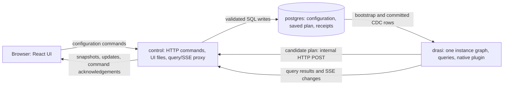
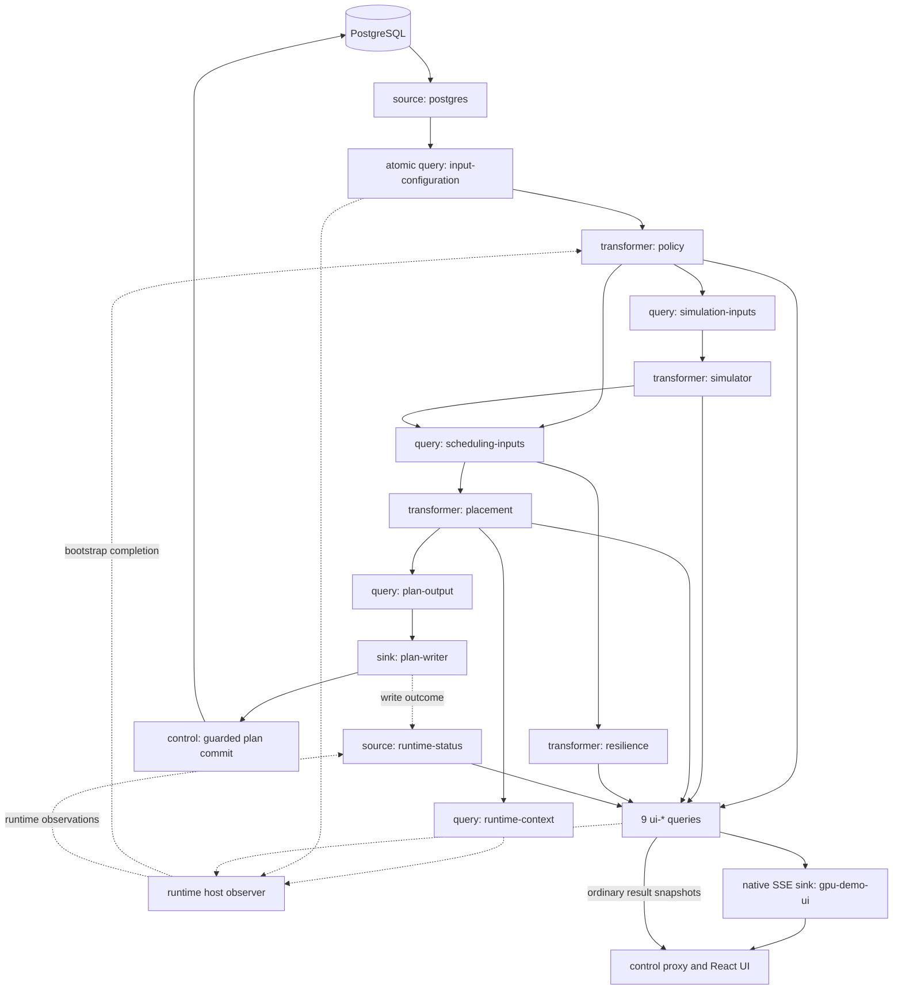

# GPU Cluster Lab: embedded hosting

This is the original custom-host demo, relocated without changing its application
behavior. `gpu-runtime` embeds `DrasiLib` and Drasi Server API/UI routes; it is not
the stock Server executable. Reusable application assets live in
[../shared/](../shared/README.md). The [Server-hosted version](../server/README.md)
is a separate, not-yet-implemented example.

## The scenario

GPU Cluster Lab demonstrates how to keep a fleet of AI services placed on suitable
GPUs as demand, capacity, failures, and processing policies change. Imagine a team
running an assistant, chat, embedding, and reranking service. Each service needs a
configured number of replicas, each replica consumes memory and compute capacity,
and some customer data may only be processed in particular regions.

A placement that works now may stop working when background GPU load increases,
a VM fails, or a customer changes its policy. Even a healthy current placement
may lack enough spare capacity to recover from the *next* failure. The demo keeps
those questions continuously answered and shows the difference between a proposed
solution and one that is actually running.

The baseline fleet has three simulated VMs in West Europe, two GPUs per VM, and
four workloads with two replicas each. You can change workload requirements, edit
background load, pause reports, fail or restore devices, add ready VMs, and change
regional policy. The system then:

1. Observes the configuration change and new GPU reports.
2. Evaluates where each workload is permitted to run.
3. Finds a complete valid placement, moving as few existing replicas as possible.
4. Saves the plan, applies it in the simulator, and waits for fresh reports to
   confirm the result.
5. Separately assesses whether the fleet could recover from additional VM or
   region failures.

This is a real PostgreSQL/Drasi/Rust/React application with **simulated GPU
execution and telemetry**. It does not require GPUs, download or run the named
models, provision Azure resources, or perform live GPU-memory migration. A
replica move represents a simulated restart on another GPU. Resource profiles
are illustrative, not model-performance benchmarks.

### Domain concepts and example scenarios

| Concept | Meaning in this example |
|---|---|
| Fleet | The whole demo, identified as `demo`. |
| Regional cluster | A group of VMs in one named region. |
| VM | The modeled failure domain. Losing a VM loses its GPUs; different VMs do not imply different physical hosts or availability zones. Backend fields retain the name `host_id`. |
| GPU | A device with its own memory and compute budget. Free memory on different GPUs cannot be pooled for one replica. |
| Workload | An AI service with a serving profile, desired replica count, data profile, and processing purpose. |
| Replica | One copy of a workload, identified by workload ID and replica index. A spread-enabled workload may have at most one replica on each VM. |
| Policy | Rules authorizing a workload's processing context in a destination region. Permission is separate from capacity and report freshness. |
| Saved / applied / confirmed | Database intent / simulator acknowledgement / matching fresh GPU-report evidence. These are deliberately different stages. |

Three starting fixtures make the behavior easy to explore:

| Starting scenario | Initial state | What it demonstrates |
|---|---|---|
| **Baseline fleet** (`baseline`) | Three VMs, six GPUs, four workloads, eight replicas in `westeurope`. | Load-driven replanning, minimal movement, report expiry, and failure recovery. |
| **Memory fragmentation** (`fragmentation`) | Three VMs and six GPUs, each initially holding one 24-GiB chat replica. | The fleet has 336 GiB free in total, but only 56 GiB free on any one GPU. Adding a 76-GiB assistant requires rearrangement, not necessarily another VM. |
| **Regional policy** (`regional-boundary`) | The baseline workloads plus two spare VMs in `northeurope` and two in `eastus`: seven VMs and fourteen GPUs. | Recovery must respect a fictional customer's EU processing policy even when healthy US capacity is available. |

The regional rule models a specific example customer agreement. It is not a
blanket statement about GDPR and does not enforce the physical location of real
data, logs, caches, or backups.

## Quickstart

### Prerequisites

- Docker with Docker Compose v2. The isolated diagnostic commands also use
  Compose's `!reset` and `!override` support.
- Git, Python 3, and a POSIX shell, as provided on macOS or Linux.
- Matching `drasi-server` and `drasi-core` checkouts beside each other:

```text
workspace/
  drasi-core/
  drasi-server/
    examples/
      gpu-cluster-lab/
        embedded/
        server/
        shared/
```

The runtime builds against that sibling Core checkout, including its local
changes. This example is not self-contained in a Server-only checkout, and
arbitrary released Core/plugin versions are not interchangeable with it.
The embedded host and native plugin must be built together. Bootstrap retains
every keyed query row, sequence watermark and explicit empty-query completion.
Small snapshots use the original single control notification; larger snapshots
use an ordered begin/chunk/commit transfer, with a SHA-256 digest and matching
transfer, runtime-epoch and sender-generation identities. Each notification is
measured including its serialized SDK wrapper and stays within Core's unchanged
16-KiB limit. Individual rows can span chunks; no rows or receipts are truncated.
The complete snapshot is bounded to 1 MiB and 513 chunks, with a 10-second sender
deadline (retrying only rejected full queues) and a 15-second receiver deadline.
Malformed, duplicate, stale, interrupted, incomplete or oversized transfers fail
closed with a diagnostic; policy/solver initialization never uses partial input.
Recovery requires a freshly constructed matched host/plugin, not a partial retry
or a scenario reset. An older runtime without this transport is not a safe
cold-start rollback for saved snapshots above its single-message limit.
This development workspace uses `agentofreality-parallel-computation-graph` in
both repositories; keep the two source trees aligned.
Host Rust, Node.js, npm, and PostgreSQL installations are **not required** for
the Docker quickstart. The first build needs access to the dependency registries.

### Start the complete live demo

From the directory containing the two checkouts:

```sh
cd drasi-server/examples/gpu-cluster-lab/embedded
./demo up
```

Open **http://localhost:5400**.

The **Drasi Server admin UI** is available at
**http://localhost:8080/ui/?instance=gpu-demo**. It displays the demo's sources,
queries, reactions, live status and query results. The existing UI does not yet
display native transformers or the complete pipe/resource topology; inspect
`http://localhost:8080/api/v1/instances/gpu-demo/computation` for that graph view.
The demo's existing read-only configuration API policy is unchanged. Use the
GPU Cluster Lab UI on port 5400 to change the scenario.

That is the complete normal startup procedure. The helper generates local
credentials, builds the React package and UI, builds matching release-profile
Rust runtime/plugin/control binaries, initializes PostgreSQL, and waits for
query-backed readiness. It seeds the baseline only when initializing an empty
database. There is no separate configuration, migration, plugin-install, or npm
step to perform first.

The first Rust/image build is the expensive part; later builds reuse Docker and
Cargo caches. If this checkout's demo is already running, simply open the URL.
Use `localhost`, not `127.0.0.1`: the configured browser-command origin is
`http://localhost:5400`, so the IP alias can display reads but its writes are
rejected.

In a fresh baseline, look for eight confirmed replicas and a confirmed placement
under **Global analysis**. A successful HTTP command only acknowledges its
database change; it is not the final confirmation.

```sh
./demo status       # Service state and actual query-backed readiness
./demo logs drasi   # Follow runtime logs; Ctrl+C stops log following
./demo down         # Stop this demo, retaining its database
```

`./demo up` preserves existing configuration and saved plans. If it cannot reach
readiness, it exits with the observed failure rather than substituting preview
data. See [known limitations and troubleshooting](#known-limitations-and-troubleshooting),
including the distinction between a rejected saved plan and unavailable inputs.

To intentionally replace the current fleet with a starting fixture, use
**Starting scenario** and **Reset scenario** in the UI, or:

```sh
./demo reset baseline
# Alternatives: ./demo reset fragmentation
#               ./demo reset regional
```

**Reset replaces the current fleet/workload/policy settings and restarts the
simulation.** Merely selecting a scenario does not apply it. A normal stop does
not reset anything. Deleting the database requires the separate explicit command
`./demo destroy --confirm gpu-demo`.

For implementation details, continue with [architecture](#how-drasi-implements-the-demo),
[domain configuration](#data-model-and-domain-configuration),
[the simulator](#transformer-the-simulator), [optimizer](#transformer-the-optimizer),
[policy engine](#transformer-the-policy-engine), [queries](#sources-and-continuous-queries),
and [UI](#the-react-ui). The later sections cover
[operations and development](#operations-diagnostics-and-development) and
[known limitations](#known-limitations-and-troubleshooting).

## How Drasi implements the demo

Drasi maintains continuous queries over database rows and native component
output. A query emits changes when its result changes, including changes caused
by scheduled time conditions. Transformers consume those result changes, perform
domain work, and emit graph-shaped evidence that other queries can use.

The feedback loop is:

**configuration -> policy -> simulated observations -> placement -> saved plan
-> simulated execution -> fresh observations -> confirmed UI state**.

This is one `DrasiLib` instance, `gpu-demo`, with one application
`ComputationGraph`. Individual continuous queries use Drasi's query machinery;
there is no second application graph, browser optimizer, or independently
maintained HTTP business-state model.

### Running services

| Compose service | Responsibility |
|---|---|
| `postgres` | PostgreSQL 16 with logical replication. Stores authoritative configuration, the saved plan, durable command receipts, and reset state. |
| `drasi` | Runs `gpu-runtime`, the instance graph, native PostgreSQL source/snapshot, native plugins, Server v1 APIs and admin UI, and native SSE sink. Port 8080 is published on loopback; SSE port 8081 remains internal. |
| `control` | Runs `gpu-control`, serves the built React UI on port 5400, implements validated commands/plan commits/reset, and proxies the selected query APIs and SSE to the browser. |
| `migrate` | A one-shot initialization job, not a fourth continuously running service. Runs schema migrations, initializes the first fixture, and configures the reset role. |
| `checks` | An on-demand Node container for live checks; not required to serve the demo. |

The control service (5400) and Drasi admin UI/API (8080) are published only on
loopback. Do not expose the admin port publicly: it has no user authentication.
PostgreSQL and inter-service traffic use the project's private Compose network.



### Components in the graph

The normal application-level topology contains **two explicit sources, fourteen
continuous queries, four transformer nodes, and two sinks**. Drasi also
creates query-result outlets and its built-in `__component_graph__` observability
source. Native queries own their future-queue wakeups directly.

There are **three primary domain engines**: the simulator, optimizer, and policy
engine. The optimizer is used by two independently scheduled transformers:
`placement` makes executable plans; `resilience` performs read-only what-if
analysis. This is why the graph has four transformer nodes rather than three.

| Instance ID | Kind / implementation | Purpose |
|---|---|---|
| `postgres` | Native source: `drasi/postgres-transactions` with coordinated `PostgresSnapshot` | Delivers complete committed transactions from seven published tables to one persistent query owner. |
| `runtime-status` | Native source: `gpu.lab/runtime-status` | Publishes observed readiness, component status, write outcomes, and semantic timeline events. |
| `policy` | Transformer: `gpu.lab/regorus-policy` | Assembles database inputs and evaluates workload/cluster authorization with Regorus. |
| `simulator` | Transformer: `gpu.lab/telemetry-simulator` | Applies saved plans, enforces policy, and produces actual simulated GPU reports and execution acknowledgements. |
| `placement` | Transformer: `gpu.lab/placement-solver` | Computes a complete minimum-movement placement and explains the decision. |
| `resilience` | Transformer: `gpu.lab/resilience-assessor` | Uses the same placement library to assess additional VM/region losses without changing the plan. |
| `plan-writer` | Native reaction/sink: `gpu.lab/plan-writer` | Submits candidate plans to the control service and reports their write outcome. |
| `gpu-demo-ui` | Native sink: `drasi.network/sse-sink` | Receives nine direct query-output edges and streams their result changes. |
| `gpu-query-log` | Optional native query-log sink | Logs selected existing query outputs when explicitly enabled; absent from the normal topology. |

The fourteen queries are listed individually in
[sources and continuous queries](#sources-and-continuous-queries).
This diagram groups the nine UI queries for
readability. Solid arrows show the main data dependencies; dotted arrows show
host observation/control or in-process status reporting.



The PostgreSQL source has exactly one immediate owner: the persistent atomic
`input-configuration` query. Policy projects its complete committed records into
graph changes for downstream joins, including deletions and empty tables.
All five native graph producers
(`policy`, `simulator`, `placement`, `resilience`, and `runtime-status`) also feed
the UI query group.

### Where construction and configuration happen

[gpu-runtime.rs](src/main.rs) is the composition root.
There is no demo-specific `server.yaml` containing this topology. Startup:

1. Loads matching `libgpu_native` and `libdrasi_computation_network` plugins.
   PostgreSQL uses the existing in-process Rust native factory, not a legacy
   adapter or a new PostgreSQL cdylib.
2. Builds `DrasiLib` with instance ID `gpu-demo` and the native component factories.
3. Builds the fourteen queries with middleware, synthetic joins and one paired
   RocksDB/source-progress/coordinated-snapshot owner in [database.rs](src/database.rs),
   admitting its component batch with automatic activation disabled.
4. Adds the native components and bounded relationships, then starts the selected
   graph components through ComputationGraph control.
5. Waits for the input query to match a current read-only database snapshot before
   bootstrapping the volatile domain engines and publishing lifecycle/readiness
   observations. The listener exposes the normal Server v1 router for the instance.

[The plugin definition](../shared/crates/native/src/lib.rs) wraps the domain libraries in
native SDK factories. Each transformer has a query-change input port, `in`, and
a graph-change output port, `out`. It consumes `QueryChangeCodec` envelopes and
emits `GraphChangeCodec` envelopes with stable identities, nested properties,
sequences, and provenance.

Factory configuration is intentionally small. For example, the simulator's
factory configuration is:

```json
{"stream": "simulator/out"}
```

The other transformer streams are `policy/out`, `placement/out`, and
`resilience/out`; the status source uses `runtime-status/out`. These objects are
passed by the runtime, not loaded from additional JSON files. They configure
stream identity, **not** GPU behavior, workload demand, or policy parameters.
Those come from PostgreSQL.

The plan writer instead receives an `endpoint` and a secret `token` reference.
The runtime resolves `internal-token` through its `gpu-runtime-secrets` resource
from `INTERNAL_TOKEN`; it does not hard-code the credential into the graph.
Most processing pipes hold 32 envelopes; UI fan-out pipes hold 64.

## Data model and domain configuration

[The SQL schema](../shared/migrations/0001_fleet.sql) and
[Rust contracts](../shared/crates/contracts/src/lib.rs) define the same domain. The database
stores intent and generation settings, while reports, execution evidence,
candidate plans, and analysis results live in the volatile graph.

### Persistent tables

| Table | Key | Configuration or state it contains |
|---|---|---|
| `regional_clusters` | `cluster_id` | Display name and `region`. The cluster identity and region are immutable after creation. |
| `placement_policies` | `policy_id` | Customer, allowed regions/purposes/classifications, name, and `authority_ref`. |
| `data_profiles` | `data_profile_id` | Customer, classification, linked `policy_id`, and authority metadata. |
| `gpu_inventory` | `gpu_id` | VM/cluster membership, GPU slot/model, VM size, memory/compute budgets, failure domain, display name, and `scheduling_enabled`. Hardware and membership are immutable; name and scheduling permission can change. |
| `gpu_telemetry` | `gpu_id` | Simulator settings: power, reporting, interval, background compute, and background memory. **These are not measured GPU samples.** Every inventory GPU must have one settings row. |
| `workload_requirements` | `workload_id` | Serving/model profile, replicas, memory/compute per replica, permitted GPU models, VM-spread rule, data profile, and purpose. |
| `gpu_placements` | `fleet_id`, always `demo` | The complete saved assignments, monotonic plan version, decision ID, configuration/policy fingerprints, policy-bundle hash, and decision details. |
| `command_receipts` | Operation kind and request key | Durable idempotency receipts, including plan-write receipts. Not a query input. |
| `demo_reset_state` | `fleet_id` | Whether reset is pending. Preserves the closed access gate across a control-process crash. Not a query input. |

Only the first seven tables are in the PostgreSQL publication. SQLX migration
bookkeeping, command receipts, and reset state are not fed into the policy graph.
Configuration tables have server-maintained `revision` and `updated_at` fields.
A real edit increments the revision; a no-op preserves both fields. Deletes
use replica identity sufficient to retract the old query input.

The bounded example permits at most eight regional clusters, eight VMs, sixteen
GPUs, thirty-two workloads, and thirty-two requested replicas in total. Policies
and data profiles are also bounded to thirty-two each. Names and IDs, hardware
profiles, model sets, and policy parameter sets are validated in both the
database and domain code.

### Hardware and serving profiles

The fixed hardware profile, `h100-nvl-pair-v1`, models an Azure
`Standard_NC80adis_H100_v5` VM with two NVIDIA H100 NVL GPUs. Each GPU advertises
94 GB nominal VRAM, but this demo deliberately budgets **80 GiB / 81,920 MiB** for
workloads and background reservations. Compute uses **100 illustrative units**,
with a planning ceiling of **85 units including background activity**.

These constants are `MEMORY_MIB` and `PLANNING_UNITS` in the contracts crate,
not tunable environment variables. At the baseline background demand of 10,
75 compute units per GPU are available for managed replicas.

| Serving profile | Model reference | Memory per replica | Compute units | Illustrative serving bounds |
|---|---|---:|---:|---|
| `assistant-v1` | `Qwen/Qwen2.5-32B-Instruct` | 76 GiB / 77,824 MiB | 55 | BF16, 8 sequences, 4,096 total tokens each |
| `chat-v1` | `meta-llama/Llama-3.1-8B-Instruct` | 24 GiB / 24,576 MiB | 30 | BF16, 4 sequences, 8,192 total tokens each |
| `embeddings-v1` | `BAAI/bge-m3` | 4 GiB / 4,096 MiB | 20 | FP16, 512 tokens, batch 16 |
| `reranker-v1` | `BAAI/bge-reranker-v2-m3` | 4 GiB / 4,096 MiB | 25 | FP16, 512 tokens per pair, batch 8 |

The baseline's eight replicas reserve 216 GiB and 260 managed compute units.
The fixture begins with this valid saved layout:

| VM | GPU 0 | GPU 1 |
|---|---|---|
| `inference-a` | Assistant replica 0 | Chat replica 0 |
| `inference-b` | Assistant replica 1 | Embeddings replica 0 and reranker replica 0 |
| `inference-c` | Chat replica 1 and reranker replica 1 | Embeddings replica 1 |

Fixture setup is labeled as such; it is not presented as a solver-generated
optimum. Subsequent placement changes use the real optimizer. Reset creates
fresh workload/GPU identities from [shared fixtures](../shared/crates/contracts/src/fixtures.rs).

The UI/API selects named serving profiles and expands their resource values
server-side. Changing `profile_id` updates the model, memory, and compute fields
together. SQL supports a `custom` profile subject to the schema's bounds;
changing only one resource field of a named profile is rejected.

### Changing configuration

The easiest path is the UI. Its commands carry the current row revision and,
for creation, an idempotency key. It never directly edits query result rows.
For example, a GPU settings patch has this shape, using the actual current
revision and GPU ID:

```http
PATCH /api/gpus/<gpu-id>/telemetry
Content-Type: application/json

{"expected_revision":"7","changes":{"background_compute_units":35}}
```

Browser requests also need the CSRF token and canonical origin; the UI handles
those. This example is a request shape, not an unauthenticated curl command.

Direct SQL exercises the same CDC path:

```sh
./demo sql
```

In the resulting `psql` session, this changes the selected running demo:

```sql
UPDATE gpu_telemetry
SET background_compute_units = 35
WHERE gpu_id = (
    SELECT gpu_id FROM gpu_inventory WHERE name = 'inference-a/0'
);
```

Use 10 to restore that baseline background setting. The update first changes
configured state, then the next simulator report changes observed demand.
For repeatable experiments that leave the presenter untouched, use the
[isolated SQL checker](#query-logging-and-reproducible-sql-checks) instead.

## Transformer: the simulator

**Node:** `simulator` (`gpu.lab/telemetry-simulator`).

The [domain library](../shared/crates/simulator/src/lib.rs) implements the simulation;
the [native wrapper](../shared/crates/native/src/processor.rs) connects it to the graph.

The simulator supplies the part that would normally be a real GPU/serving
platform: execution state, resource measurements, application acknowledgements,
and periodic heartbeats. It is a transformer rather than a disconnected mock
source because it consumes the current configuration, policy, and saved plan
through `simulation-inputs`.

### Inputs and configurable behavior

`simulation-inputs` joins `FleetConfiguration` with its matching
`PolicyAssessment`. Its output includes the observation epoch, inventory,
workloads, generation settings, saved plan, and policy batch. An optional policy
match allows the simulator to distinguish "configuration observed, policy still
pending" from an absent configuration.

| `gpu_telemetry` field | Default | Effect |
|---|---|---|
| `powered_on` | `true` | When false, removes execution on the device and stops its reports. Restoring power makes reports due again. |
| `reporting_enabled` | `true` | Controls report generation without itself stopping execution. The scheduler may subsequently move work when reports expire. |
| `interval_ms` | `1000` | Report interval per GPU; allowed range is 250-2,000 ms. |
| `background_compute_units` | `10` | Synthetic demand outside the managed replicas; allowed range is 0-200. It can deliberately make a GPU unsuitable for a plan. |
| `background_memory_mib` | `0` | Requested background reservation; allowed range is 0-81,920 MiB. |

The native wrapper checks scheduled work every 25 ms. **That is not a 25-ms
telemetry interval:** the default six-GPU fixture produces approximately six
samples per second, with simultaneously due samples emitted together.
Monotonic deadlines schedule reports; samples carry actual UTC report timestamps.

`gpu_inventory.scheduling_enabled` is a separate control. It prevents a GPU from
being a valid planned destination; it is not a power-off command.

### Applying plans and enforcing policy

The simulator validates the complete saved plan against current requirements,
policy, power state, resource availability, and VM separation before applying
it. A newer database version is not automatically an applied version. A rejected
application leaves an explicit attempted version and error.

Policy is continuously enforced against existing execution as well as new plans:

| Authorization / condition | Execution behavior |
|---|---|
| Current allow with a valid assignment | Processing can run. |
| Unknown, missing, or stale policy | Processing is suspended; memory remains reserved. |
| Current deny | Execution is fenced: processing stops and its memory reservation is released. |
| Source invalidation | Authorization is invalidated; a fresh source/bootstrap and policy observation are needed for recovery. |
| Power off or removed workload replica | The affected execution is retired. |

A still-matching desired assignment can resume after authorization returns,
provided current resources and separation still permit it. Changing the data
profile or purpose requires a matching newly committed assignment. Execution
recovery does not manufacture a partial saved plan.

The simulator emits:

- `GpuSample`: GPU ID, epoch, report sequence/time, inventory/settings revisions,
  applied plan version, background/managed demand, and memory use.
- `AppliedPlan`: attempted/applied version, application error, source state,
  observed configuration, and actual execution.
- `PolicyEnforcement`: per-replica running/suspended/fenced state, assignment,
  policy context, applied version, and acknowledgement time.

Running replicas contribute managed compute and resident memory. Suspended
replicas contribute memory but not managed compute. Fenced replicas contribute
neither. Requested background memory and actually allocatable background memory
are reported separately, so the UI does not hide pressure by changing the request.

Changing a setting or acknowledging a plan does **not** refresh a GPU sample.
The five-second freshness condition is evaluated by Drasi queries, not by the
browser. A powered-off GPU may therefore still have a recent *last report*
until that deadline; power state and report health are different facts.

## Transformer: the optimizer

**Nodes:** `placement` (`gpu.lab/placement-solver`) and read-only `resilience`
(`gpu.lab/resilience-assessor`), using the
[shared optimizer library](../shared/crates/placement/src/lib.rs).

Both nodes consume `scheduling-inputs`. That query combines configuration,
matching policy, the previous saved plan, and capacities derived from current
GPU reports. Missing, old-epoch, or five-second-expired reports do not supply
eligible capacity.

### Placement constraints and objectives

The optimizer uses `good_lp` with the `microlp` mixed-integer solver. Candidate
replica-to-GPU assignments must satisfy all of the following:

- Every requested replica is assigned exactly once.
- Each replica fits entirely on one GPU.
- Total managed memory fits after the reported background memory request.
- Total managed compute fits within 85 minus reported background demand.
- The GPU model is allowed and scheduling is enabled.
- Current policy explicitly permits that workload in the GPU's cluster.
- A spread-enabled workload has at most one replica per VM/failure domain.

The previous complete placement is retained immediately if it is still valid.
Otherwise, optimization first minimizes **moves of existing replicas**, then
minimizes **peak demand relative to available compute capacity** while preserving
that minimum move count. Newly requested replicas are counted separately from
moves. Healthy work is not shuffled merely to return to a fixture layout or fill
newly added spare capacity.

The MILP scales memory constraints to GiB for numerical conditioning; final
assignment validation still uses exact integer MiB. A timeout or solver error is
`unknown`, not proof of infeasibility. An infeasible result publishes an
explanation, not a partial replacement plan.

The native scheduler uses one shared solver worker for placement and resilience,
with placement taking priority between resilience scenarios. Each solve gets a
two-second budget. Input changes are coalesced with a 100-ms scheduling delay;
completed work is checked against its input signature/generation before
publication. These are implementation constants, not exposed factory settings.

### Configuration that drives optimization

| Input | How it changes the problem |
|---|---|
| Workload replicas/profile/resources | Adds or removes required assignment variables and changes per-replica costs. |
| `allowed_gpu_models` | Removes incompatible destinations. |
| `spread_across_domains` | Enables or disables per-workload VM separation. |
| Inventory and `scheduling_enabled` | Adds/removes destinations or excludes a device from plans. |
| Fresh reports and background settings | Determine currently observed memory/compute headroom and eligibility. |
| Data profile, purpose, policy parameters | Determine the allowed workload/cluster pairs. |
| Current saved assignments | Define which placements would count as moves. |

For example, changing background demand on `inference-a/0` from 10 to 35 leaves
only 50 assignable compute units there. Its 55-unit assistant must move. After
background demand returns to 10, the new valid placement can stay where it is.

In the fragmentation fixture, adding one assistant needs a 76-GiB gap. Moving
one 24-GiB chat replica beside another chat frees a whole 80-GiB GPU. Multiple
equally good destinations can exist; the demo reports the actual solution rather
than expecting one hard-coded destination.

`placement` emits `SchedulingContext`, `CandidatePlan`, and `DecisionExplanation`.
Explanations include existing/new/retained counts, actual moves, reason codes,
input fingerprints, and pre-plan free-memory/largest-gap facts.
`plan-output` extracts the candidate payload for the writer.

### Read-only resilience analysis

`resilience` asks whether the **same complete requirements** could be placed after
losing each currently eligible VM or region. Each scenario removes those
destinations from a copy of the capacity input and runs the same constraints,
including policy. It emits a correlated `ResilienceAssessment`; it never sends
an executable plan to the writer.

Current success and resilience are independent. Adding two chat replicas to
baseline yields ten replicas consuming 320 managed units, which fit now. Losing
one VM leaves four GPUs with only 300 baseline assignable units, so recovery is
infeasible. Adding another ready VM can restore recovery capacity without
moving existing healthy work.

When permitted placement is infeasible, the optimizer can also emit a separate
`CapacityDiagnostic` asking whether capacity alone would suffice without the
policy restriction. This is explanatory evidence only, never permission to
execute a policy-bypassing plan. Unknown or empty analysis is not displayed as a
passing resilience result.

## Transformer: the policy engine

**Node:** `policy` (`gpu.lab/regorus-policy`), implemented by
[the policy library](../shared/crates/policy/src/lib.rs) and
[the Rego module](../shared/policies/placement.rego).

The policy node has two related jobs. First, it reconstructs the current domain
input from `input-configuration` and its explicit keyed bootstrap snapshot.
It publishes `FleetConfiguration`, including generation settings and the saved
plan. Second, it evaluates processing authorization with the actual Regorus Rego
engine and publishes `PolicyAssessment` plus per-pair `PlacementEligibility`.

The input to a policy decision follows this chain:

```text
workload_requirements.data_profile_id
  -> data_profiles.policy_id
  -> placement_policies
  + workload purpose
  + destination regional_clusters row
```

### Rules and policy parameters

The Rego module is compiled into the policy crate using `include_str!`; changing
the rule text requires rebuilding the code. Its **parameters are database rows**
and can change at runtime without rebuilding the plugin.

The rule allows a workload/cluster pair only when the region, processing purpose,
classification, and customer relationship are all permitted. It returns explicit
reasons such as `region-not-permitted`, `purpose-not-permitted`,
`classification-not-permitted`, and `customer-mismatch`.

| Parameter | Baseline / fragmentation | Regional-policy fixture |
|---|---|---|
| Policy ID | `demo-permissive` | `customer-eu-processing` |
| Customer | `demo` | `customer-eu` |
| Data profile | `demo-open` | `customer-eu-documents` |
| Classification | `synthetic` | `restricted` |
| Workload purpose / allowed purposes | `demo` / `["demo"]` | `customer-support` / `["customer-support"]` |
| Allowed regions | `["*"]` | `["westeurope","northeurope"]` |
| Allowed classifications | `["synthetic"]` | `["restricted"]` |
| Authority metadata | `demo-fixture` | `customer-eu-contract-v1` |

Wildcard regions are restricted by the contracts/schema to the synthetic demo
policy; they are not a general way to bypass the customer policy. Clearing
allowed regions denies processing everywhere. A policy can deny a destination
even if its GPU has a fresh report and ample capacity.

The UI's **Edit policy** dialog edits allowed regions. Other permitted policy
fields can be changed through the configuration API or SQL. A workload's
`data_profile_id` and `purpose` select the context to evaluate; `authority_ref`
is included as explanation/fingerprint metadata, not interpreted as a legal
authority by the program.

### Evaluation and failure semantics

Each batch covers every workload/cluster pair, not just the currently selected
destinations. It carries a policy-bundle hash, assessment signature, and
per-pair input fingerprints. Queries join the result back to its matching
configuration, and consumers reject stale or incomplete batches.

One policy worker runs bounded background jobs. Regorus has a 50-ms execution
limit per pair evaluation. Missing or
invalid context, evaluation failure, or stale authorization is **unknown**, never
an implicit allow. Unknown policy suspends simulator processing; a current deny
fences it.

Authorization is checked at three boundaries: the optimizer filters candidate
destinations, the control service re-evaluates policy before committing a plan,
and the simulator enforces it during application and continued execution.
The shared policy library and Rego bundle keep those checks consistent.

## Sources and continuous queries

### PostgreSQL source and bootstrap

The runtime constructs the native transactional PostgreSQL source and its paired
coordinated snapshot provider with:

| Setting | Value |
|---|---|
| Source ID | `postgres` |
| Database / host | `gpu_demo` / Compose service `postgres` |
| Reader | `gpu_reader`, using `REPLICATION_PASSWORD` |
| Publication | `gpu_demo_publication` |
| Replication slot | Query-owned `gpu_native_<uuid>`; retained with the query state |
| Tables | The seven published domain tables listed above, with explicit primary-key mappings |
| Connection mode | SSL disabled inside this local demo network |

The source imports an exported snapshot and resumes from its exact WAL boundary.
It emits one bounded envelope per committed transaction (1,024 changes, 8 MiB,
30 seconds). The query persists both its state and committed source cursor before
WAL acknowledgement. Concurrent slot ownership and missing/changed history fail
explicitly. PostgreSQL must retain slot WAL without a size cap; monitor disk use.
This is a dedicated local-demo configuration, not a production deployment recipe.

The connector represents JSON/JSONB columns as strings. Before query evaluation,
[postgres.rs](../shared/crates/native/src/postgres.rs) applies table-specific strict JSON
parsing using the existing `parse_json` middleware. It decodes policy sets,
workload GPU-model sets, and saved-plan assignments/decision details, preserving
other values and record identities.

The host observes a keyed snapshot and output watermark for `input-configuration`.
Its tagged `records` collection includes all seven tables; an absent table means
an explicitly empty table, not a missing independent feed. The query exposes only
the final configuration of a committed transaction. On restart the host compares
this query snapshot with a current repeatable-read, read-only database snapshot;
stale recovered rows cannot alone open readiness. Reset also requires the expected
saved-plan decision identity.

**Atomic input is not atomic downstream effects.** Domain workers, different UI
queries, HTTP plan commits and browsers still complete independently. The health
contract retains `transaction_completion: "not-supported"` for that stronger
whole-application guarantee.

### Runtime-status source

`runtime-status` uses the native plugin's shared, in-process status hub to emit:

| Graph label | Meaning |
|---|---|
| `RuntimeStatus` | Latest actual component status and error. |
| `DemoReadiness` | Source/query bootstrap, observation epoch, current signatures, `inputs_ready`, and final scenario readiness. |
| `PlanWriteOutcome` | Typed committed/rejected/failed/superseded writer outcome, correlated to its decision. |
| `DemoEvent` | Semantic lifecycle/decision events with epoch, sequence, UTC time, and decision/plan links. |

The host observer reads actual component status and query snapshots and sends
generation-bound control notifications into the loaded plugin. The hub is not
another query engine. Its timeline is bounded to 128 semantic events rather
than retaining every telemetry tick.

`inputs_ready` is the source/input lifecycle gate; `scenario_ready` additionally
requires correlated current analysis and execution evidence. Confirmation
queries depend on the input gate, not final readiness, avoiding a circular
dependency. If simulator initialization succeeds but its saved plan cannot be
applied, the status is `application-rejected` with the error retained; that does
not itself close the corrective-input gate. Actual source/bootstrap failures
still do.

### All fourteen registered queries

The registration sources are
[inputs.rs](../shared/crates/native/src/inputs.rs) and
[projections.rs](../shared/crates/native/src/projections.rs). Query IDs below are the actual
IDs in instance `gpu-demo`.

#### One transactional database-input query

`input-configuration` is generated from the table contracts. It maintains one
aggregate row containing `{table, value}` records from every published table.
The policy node consumes whole-configuration deltas and the keyed bootstrap
watermark. It never assembles seven independent query feeds.

| Table | Downstream use |
|---|---|
| `regional_clusters` | Destination membership, names, and policy regions. |
| `placement_policies` | Runtime policy parameters and revisions. |
| `data_profiles` | Customer/classification/policy relationships. |
| `gpu_inventory` | Hardware, membership, capacity limits, and scheduling permission. |
| `gpu_telemetry` | Simulator power/reporting/background-generation settings. |
| `workload_requirements` | Desired replicas and their complete requirements. |
| `gpu_placements` | Complete saved plan, version, and decision evidence; closes the plan-write feedback loop. |

#### Four processing queries

| Query | Inputs and result | Consumer |
|---|---|---|
| [`simulation-inputs`](../shared/queries/simulation-inputs.cypher) | `FleetConfiguration` with optional matching `PolicyAssessment`; returns the configuration/settings/plan snapshot plus policy and epoch. | `simulator` |
| [`scheduling-inputs`](../shared/queries/scheduling-inputs.cypher) | Matching fleet/policy context plus inventory and fresh `GpuSample` evidence; collects per-GPU observed capacity inputs. | `placement` and `resilience` |
| `plan-output` | `MATCH (p:CandidatePlan) RETURN p.payload AS payload` | `plan-writer` |
| `runtime-context` | `SchedulingContext` projected to scheduling/policy signatures, required replicas, and currentness. | Host readiness observer |

`plan-output` and `runtime-context` are defined inline in `inputs.rs`.
The other `.cypher` files in `queries/` include reference/test queries;
placing a file there does not register another running query.

#### Nine UI queries

| Query | Stable row key | How its inputs become UI evidence |
|---|---|---|
| [`ui-clusters`](../shared/queries/ui-clusters.cypher) | `cluster_id` | Joins clusters, inventory, and samples; reports distinct VM count and recent-report GPU count, retaining empty clusters. |
| [`ui-gpus`](../shared/queries/ui-gpus.cypher) | `gpu_id` | Joins inventory, cluster, settings, and optional sample; distinguishes configured values from measured load, power from report health, and absent samples from zero load. |
| [`ui-workloads`](../shared/queries/ui-workloads.cypher) | `workload_id` | Combines requirements, saved/applied plans, scheduling/readiness context, execution, policy, and samples into running/confirmed/suspended/fenced counts. |
| [`ui-placements`](../shared/queries/ui-placements.cypher) | `fleet_id` | Correlates the saved plan with actual execution and confirmation evidence; reports desired/applied/confirmed versions, assignments, status, and reason. |
| [`ui-policy`](../shared/queries/ui-policy.cypher) | `id`, a workload/cluster pair | Projects `PlacementEligibility`: allow/deny/unknown, reasons, revisions, authority, regions, fingerprints, and errors. |
| [`ui-resilience`](../shared/queries/ui-resilience.cypher) | `fleet_id` | Joins `ResilienceAssessment` to any matching `CapacityDiagnostic`; separates permitted recovery from capacity-only analysis. |
| [`ui-decisions`](../shared/queries/ui-decisions.cypher) | `decision_id` | Joins `DecisionExplanation` to writer outcomes; exposes proposed/committed/rejected/diagnostic stages, moves, and pre-plan memory evidence. |
| [`ui-status`](../shared/queries/ui-status.cypher) | `fleet_id` | Projects `DemoReadiness`, including scenario, epoch, signatures, input readiness, and nested component status. |
| [`ui-timeline`](../shared/queries/ui-timeline.cypher) | `event_id` | Projects semantic `DemoEvent` records with decision/plan links; identity includes epoch and event sequence. |

#### Relationships and time-aware behavior

The source tables do not contain graph edges. Registration supplies synthetic
joins that relate records by their keys:

| Relationship | Labels and matching property |
|---|---|
| `POLICY_CONFIG` | `FleetConfiguration` and `PolicyAssessment` by `config_fingerprint` |
| `GPU_CLUSTER` | `gpu_inventory` and `regional_clusters` by `cluster_id` |
| `GPU_SETTINGS` | `gpu_inventory` and `gpu_telemetry` by `gpu_id` |
| `GPU_SAMPLE` | `gpu_inventory` and `GpuSample` by `gpu_id` |
| `EXECUTION_WORKLOAD` | `PolicyEnforcement` and `workload_requirements` by `workload_id` |
| `EXECUTION_GPU` | `PolicyEnforcement` and `gpu_inventory` by `gpu_id` |
| `EXECUTION_SAMPLE` | `PolicyEnforcement` and `GpuSample` by `gpu_id` |
| `EXECUTION_POLICY` | `PolicyEnforcement` and `PlacementEligibility` by `input_fingerprint` |
| `DECISION_WRITE` | `DecisionExplanation` and `PlanWriteOutcome` by `decision_id` |
| `RESILIENCE_DIAGNOSTIC` | `ResilienceAssessment` and `CapacityDiagnostic` by `scheduling_signature` |

These join settings are part of a query's configuration; copying only its Cypher
text is not enough to reconstruct it. Optional/disconnected matches let queries
retain a workload or cluster before its corresponding execution/report/context
exists.

The scheduling, GPU, cluster, workload, and placement queries use
`drasi.trueNowOrLater` with a deadline at `report_time_ms + 5000`. Drasi schedules
the future reevaluation, so a result can change because a report is *absent*,
without another database update or GPU event. Transport SSE keepalives do not
count as GPU heartbeats.

## Reactions, commands, and the saved-plan loop

### Plan writer

The native `plan-writer` sink consumes `plan-output` and posts its complete
candidate to `POST /internal/placement-plans` on the control service. Accepting
the query input into this asynchronous sink is explicitly not a database commit.
Its owned worker publishes a separate write outcome through `runtime-status`.

Inside the commit transaction, the control service:

1. Takes the shared fleet advisory lock, `778807123`.
2. Checks any existing receipt for the decision ID and identical payload.
3. Checks the expected saved-plan version and current configuration fingerprint.
4. Re-evaluates the current policy and checks its signature/bundle hash.
5. Validates complete assignments against current static inventory, resource
   limits, compatibility, and spread rules.
6. Increments the saved version and commits both plan and receipt together.

The writer uses a five-second HTTP timeout and at most five attempts for
transport/server failures, retrying the same decision identity with backoff.
HTTP 409 is terminal, not blindly retried. Superseding input stops retries for
an obsolete candidate; it cannot undo an HTTP request that already committed.
Durable receipts make retrying a committed decision acknowledge that commit
rather than write another version.

Commit-time checks are not claims of current GPU execution or fresh telemetry.
The simulator separately checks current power/settings and applies the observed
saved plan; only subsequent reports can confirm it.

### A complete change, step by step

Consider increasing background demand on the GPU hosting an assistant:

1. The UI issues a revision-checked settings command; control commits
   `gpu_telemetry` and acknowledges the write.
2. PostgreSQL CDC commits the complete `input-configuration` update to the
   policy/input assembler, whose `FleetConfiguration` updates
   `simulation-inputs`.
3. The simulator produces its next real report with the new background demand.
   `scheduling-inputs` derives reduced observed headroom.
4. The optimizer emits a candidate and explanation. `plan-output` delivers the
   candidate to the plan writer.
5. Control validates and commits the plan. CDC carries the saved row back through
   `input-configuration` and the input assembly path; an HTTP receipt alone does not do this.
6. The simulator observes that saved plan, applies valid assignments, and emits
   application/execution acknowledgements.
7. Fresh GPU samples reflect the applied version. `ui-workloads` and
   `ui-placements` then promote matching replicas/the whole plan to confirmed.
8. The native SSE sink delivers these query changes to React; the resilience node
   publishes its separate analysis for the new scheduling signature.

Whole-plan confirmation requires matching versions, observation epochs,
configuration/policy/scheduling context, exact assignments and resource
requirements, current authorization, and fresh samples no older than the relevant
application acknowledgement. Null/unknown evidence cannot satisfy that predicate.

### Commands, permissions, and reset

| Interface | Purpose |
|---|---|
| `POST /api/workloads`, `/api/hosts`, `/api/gpus`, `/api/clusters` | Create configured entities; creation uses an idempotency key. Adding a VM registers already-ready simulated capacity, not real cloud provisioning. |
| `PATCH /api/<kind>/<id>` | Edit `gpus`, `workloads`, `policies`, or `telemetry` with `expected_revision`; workload profile changes expand the corresponding resource fields. |
| `DELETE /api/gpus/<id>`, `/api/workloads/<id>` | Delete a GPU or workload with an `If-Match` revision header. |
| `PATCH /api/gpus/<id>/telemetry` | Edit one GPU's generation settings. |
| `PATCH /api/hosts/<id>/telemetry`, `/api/regions/<id>/telemetry` | Apply a grouped settings command with the expected GPU membership/revision set. |
| `POST /api/demo/presets/<name>` | Explicitly replace the fixture and reconstruct the runtime. |
| `GET /health/ready` | Observe actual query-backed readiness, not merely container liveness. |

The browser obtains a CSRF token from `/api/csrf` and sends it with the exact
configured origin. Internal commands use `INTERNAL_TOKEN` and are not browser
credentials. Database roles separate configuration writes (`gpu_config`), plan
writes (`gpu_plan`), replication reads (`gpu_reader`), reset (`gpu_reset`), and
migration ownership (`gpu_owner`). Normal control processes do not use the
migration owner's credentials.

Reset persists its pending intent before stopping the graph, gates/drains access,
seeds the selected fixture in a transaction, reconstructs a new runtime epoch,
and reopens access only after observed readiness. A failed reset remains gated
across control-process restart until an explicit retry succeeds. Prior SSE
generations are closed, and the UI reconnects its existing subscriptions.

Reset retains command/plan receipts. Retrying an old successful creation returns
its historical receipt without resurrecting deleted work in the new fixture.
Stopping and starting normally preserves the full database; it does not seed a
new fixture. The transactional input query persists in the `native-state` volume
at `GPU_STATE_DIR=/var/lib/gpu-runtime`, paired with its PostgreSQL slot. Reset uses
transactional deletes/inserts, not TRUNCATE, and preserves both that slot and state.
Other queries and domain engines remain volatile and require fresh confirmation
under a new epoch.

Back up and restore the PostgreSQL database/WAL and `native-state` together.
Do not delete either side independently, drop slots by prefix, or run two
runtimes against one state directory. Interrupted initialization, missing WAL,
or a changed binding requires explicit recovery rather than automatic reseeding.
`demo destroy --confirm gpu-demo` removes both owned volumes; for a separately
managed database, an operator must identify and retire the exact inactive slot
only after permanently retiring its query owner. The example does not guess
ownership or offer automatic slot retirement.

## The React UI

The UI is a React 18/Vite application using the pinned `@drasi/react` SDK. Its
entry point is [main.tsx](../shared/ui/src/main.tsx); [App.tsx](../shared/ui/src/App.tsx) hoists exactly
one subscription to each of the nine UI queries above the display components.

The provider uses the current page origin, instance `gpu-demo`, native sink
`gpu-demo-ui`, the proxied `/events/gpu-demo` endpoint, and the SDK's
`sse034ResultAdapter`. The control proxy exposes only the named UI query
configuration/results routes, the read-only computation graph, and SSE, not
arbitrary Server management writes. The shared
[native browser binding](../../native-sse-client/index.tsx) validates the actual
running native sink and its direct edges instead of fabricating a legacy
Reaction DTO for the pinned SDK.

Initial result snapshots and subsequent SSE changes come from the same actual
queries. The SDK maintains rows by the stable keys above and handles reconnects.
If an SSE subscriber falls behind, the sink logs and closes that subscription
so the SDK can reconnect and fetch fresh snapshots.

[rows.ts](../shared/ui/src/rows.ts) validates the real row contracts. Revisions and plan
versions are decimal strings; missing counts/measurements are null, not zero.
Duplicate identities, unknown values, or stale data are not converted into
successful evidence.

The workload aggregate groups only by the stable workload entity. Execution
availability and readiness are aggregated values, not additional grouping keys.
Otherwise, a readiness transition can emit a new group and delete the old group
under the same UI `workload_id`, losing the live row even when a fresh snapshot
still contains it. The native regression replays public result deltas by that
key and compares them with snapshots across readiness, policy-state, and rename
transitions.

### What to inspect

| UI area | What it shows or controls |
|---|---|
| Header | Starting scenario, explicit Reset, System status, Global analysis, and a domain Help guide. |
| Workloads | Required, running, and confirmed replicas; profile/context; create, edit, scale, delete, and Edit policy. Each row has a default-closed expander for individual replica status and locations. Selecting a workload highlights its replicas and permitted destinations. |
| Regional panels | Registered VMs, GPU report status, and planned/running/confirmed regional counts. Add ready VM and region failure/restore controls belong to the region. |
| VM/GPU cards | Device power, reporting and scheduling state, configured versus measured load, memory reservations, and separate Planned/Running sections with Stopped, Paused, or Stopping when applicable. Expand for settings and technical evidence. |
| Global analysis | Saved/applied/confirmed placement progress, actual optimizer decisions and moves, and separate recovery-after-failure assessments. |
| Policy details | Per-workload/destination permission, reasons, authority, parameters, revisions, and fingerprints. |
| Activity | Bounded semantic timeline, including actual replica moves naming their source/destination GPUs, with links to the corresponding decision or plan. |
| System status | Actual component failures and readiness state, available even when editing is disabled. |

Global analysis slides into a right-hand column aligned with the top of
Workloads. Workloads, regions, and Activity remain together in the left column,
without an empty row above the analysis or an artificial gap above the regions.
Closing analysis restores the main column's width.
Workloads, Activity, and Global analysis share the Region panels' outer frame,
surface, and header styling. Nested VM/GPU cards and the inner analysis cards
remain visually distinct from these top-level sections.

### Replica placement and movement

Every GPU uses the same sectioned layout; there is no layout selector or separate
move ledger:

| Section | Meaning |
|---|---|
| **Planned** | A pending destination in the saved plan, not a claim that execution has started there. The current location is stated if the replica still runs elsewhere. |
| **Running** | Observed execution on this GPU. Confirmation is a separate indicator requiring current plan/policy and fresh reports. |
| **Stopped** | An observed policy stop on this GPU; reservations have been released. |
| **Paused** | Observed suspension with memory still reserved, not running execution. |
| **Stopping** | A requested stop whose completion is not yet confirmed. |

A replica already observed on its planned GPU has one pill, with **Also planned
here** recording the saved intent. It is not duplicated in Planned and Stopped
or Planned and Running on that same device. A different planned destination can
still appear on another GPU, but it is explicitly separated from the running
copy. Never-started replicas denied by policy remain blocked Planned entries;
the UI does not invent a past stop. Unknown or stale execution is labeled as
unknown/last observed rather than counted as current running work.

Within one GPU, observed section changes can animate the pill between its old
and new positions. A cross-GPU move does not fly across the page: the destination
fades/pulses and the source/destination show a short explanatory note. These
four-second decorations never delay query updates, counts, or execution.
Initial loading, reconnect snapshots, replacement epochs, and heartbeat-only
updates do not replay moves. Disable cues with **Help → Animate observed replica
changes**; the OS reduced-motion preference replaces motion with static cues.

The existing **Activity** log records actual moves such as
`chat replica 1 moved from inference-a / GPU 1 to inference-b / GPU 1`.
These messages are emitted by the simulator after application, not generated
from a saved candidate or from animation timers, and remain in the bounded
timeline after the visual cue ends.

Expand **Workloads**, then use the chevron on a workload row to inspect each
replica's Planned location, Running/Paused/Stopped location, status, and
confirmation. Requested replicas without an allocation and old replicas still
awaiting retirement are explicit. Each workload's expansion is independent and
does not change its selection or send a command.

### Containment and presenter highlighting

The view distinguishes regions with a strong outer frame, VMs with a chassis
boundary and left rail, GPUs with device cards and explicit slot labels, and
replicas with smaller tiles and their own icon. The collapsed region preview
also labels VMs and GPUs. Workload definitions remain in the fleet-level
Workloads panel; their replicas are the objects placed inside GPUs.

Regions and Workloads start collapsed. VM interiors start open inside their
region, retaining one-click access to GPU cards when the region is expanded;
each VM can also be collapsed independently.

Open **Help** and use **Region**, **VM**, **GPU**, or **Workloads** under
**Explain the hierarchy**. The selected type gets a visible outline without
changing health/policy colors. Workloads highlights both the definition chips
or table rows and the corresponding actual/saved replica tiles.
The longer domain glossary is available under **How to read this demo**, keeping
the presenter controls compact.

**Temporarily reveal collapsed regions and VMs** opens the parents needed to
show the selected type. Press the same button again, **Clear highlight**, or
**Escape** to restore their previous expansion state. Closing Help also clears
the mode. Existing workload selection and expanded GPU details are preserved.
An open modal handles Escape first; otherwise highlighting clears before
Global analysis closes. Controls support keyboard activation and reduced motion.
If restoring a collapsed container hides the focused item, focus returns to the
presenter control.

This is view-only behavior implemented in [Hierarchy.tsx](../shared/ui/src/Hierarchy.tsx).
It does not issue commands, change query rows, or create query/SSE subscriptions.
It remains usable for inspection when feeds are stale without enabling ordinary
mutations or turning stale evidence into a current result.

The UI uses **VM** where some contracts still say `host` or `worker`, and
**Confirmed** where the workload projection's field is `ready_replicas`.
Regional counts combine the existing query evidence; a workload's required
replicas do not belong to one fixed region.
Regional execution counts do not require a successfully applied plan: the
query's `blocked` and `awaiting-application` states already establish that the
simulator's execution was observed. A known empty execution list therefore shows
zero running and confirmed replicas. Missing/stale observations, unresolved
destinations, and pending stop acknowledgements retain their uncertainty.
GPU cards use the same distinction for their empty-execution message.

GPU report age/version metadata uses a non-wrapping, ellipsized line beside the
report badge so changing values cannot move the card contents up and down.
The full text remains available on hover and in the expanded GPU details.
An observed report without an applied version says **No plan applied**, not
**Plan unknown**; an absent report says **Awaiting first report**.

**Recent report** is not synonymous with **powered on**, **allowed by policy**,
or **confirmed replica**. Likewise, **Saved** does not mean **Applied**, and
current success does not mean the next failure is survivable.
The UI distinguishes these states rather than reducing them to one green badge.

Status colors are consistent across expanded cards, collapsed GPU previews,
replica/workload states, analysis, and component status:

| Color | Meaning |
|---|---|
| **Red** | A definite negative result: powered off, report overdue, stopped by policy, explicitly denied, failed/unavailable component, rejected decision, or a current recovery check that cannot succeed. |
| **Amber** | Incomplete, transient, or uncertain evidence: starting, reconnecting, awaiting application/reports, partially confirmed, paused, stop requested, or unknown/stale state. |
| **Green** | Current successful evidence, such as a recent report, an allowed policy decision, or a confirmed replica. |

These colors do not merge independent facts. A GPU configured off has a red
frame and power indication even while its last report remains recent; the
report badge turns red only when that report actually expires. A powered-on GPU
with overdue reports is a reporting failure, not proof of a power failure.
The same explicit off/overdue states are red in collapsed previews. A fully
policy-stopped workload is red; partial confirmation or a pending stop remains
amber. Presenter and selection highlights keep their separate blue outline.

When transport is disconnected or input evidence is stale, retained rows cannot
enable mutations or claim current success. The supported SDK connection-status
hook surfaces ongoing reconnect errors, including before the first snapshot.
Browser offline/online changes trigger the same supported reconnection path.
Dialogs and acknowledgements do not optimistically replace CQ results.

### A short walkthrough

Start each experiment from the named fixture if you need its exact layout;
resets replace previous edits.

1. **Baseline:** raise background compute on `inference-a/0` to 35. Follow the
   assistant move through saved, applied, and freshly confirmed stages.
2. **Fragmentation:** add one `assistant-v1` replica. Inspect the one existing
   chat move and one new placement; total free memory alone was insufficient.
3. **Baseline resilience:** add a two-replica chat workload. Compare ten
   confirmed replicas with insufficient one-VM recovery capacity, then add a
   ready VM and observe the reassessment.
4. **Missing reports:** pause one GPU's reporting without powering it off.
   Wait for the actual five-second deadline, inspect the resulting decision,
   and resume reports.
5. **Regional policy:** fail the primary region and observe permitted recovery
   into North Europe. Healthy US GPUs are not authorized substitutes. Revoke
   permission and inspect execution fencing separately from GPU health.

The longer [presenter runbook](../shared/docs/gpu-cluster-demo-runbook.md) includes
preconditions, recovery steps, and expected outcomes for each scenario.

## Build layout and process configuration

### Source map

| Location | What to read or change |
|---|---|
| [compose.yaml](compose.yaml), [demo](demo) | Service wiring, environment, startup/reset/cleanup commands. |
| [ops/runtime.Dockerfile](ops/runtime.Dockerfile), [ops/control.Dockerfile](ops/control.Dockerfile) | Release builds and runtime packaging. |
| [ops/export-runtime.py](ops/export-runtime.py) | Exports current Core/Server/example sources and content hashes without switching branches. |
| [crates/contracts](../shared/crates/contracts) | Domain types, hardware/serving catalogs, validation, fingerprints, and shared fixtures. |
| [crates/policy](../shared/crates/policy), [policies/placement.rego](../shared/policies/placement.rego) | Regorus evaluation and policy rules. |
| [crates/simulator](../shared/crates/simulator) | Execution/application/report-generation model. |
| [crates/placement](../shared/crates/placement) | Placement optimization, resilience, and capacity-only analysis. |
| [crates/native](../shared/crates/native) | Shared SDK factories, envelopes, input assembly, lifecycle, scheduled work and evidence. |
| [src/main.rs](src/main.rs), [src/diagnostics](src/diagnostics) | Embedded runtime composition and host diagnostics. |
| [control/main.rs](control/main.rs) | Embedded HTTP commands/proxies and runtime-reset coordination. |
| [crates/control](../shared/crates/control), [migrations](../shared/migrations) | Shared SQL validation, receipts, plan writer, roles and publication. |
| [queries](../shared/queries) | Checked-in processing/UI Cypher and supporting query examples/tests. |
| [ui/src](../shared/ui/src) | Provider/hooks, row validation, display components, command dialogs, labels, and styles. |

The `../shared/` Cargo workspace contains the five domain/control crates.
`../shared/crates/native` is a separate workspace because it also depends on the
sibling Core and parent Server source trees. Its lockfile is separate. The Cargo
manifests reference the embedded executable sources explicitly, preserving the
existing `gpu-control` and `gpu-runtime` binary names.

The launcher stages matching current source in `.build/runtime-src`, including
uncommitted source changes, and records file hashes in `/app/source-manifest.json`
inside the runtime image. Runtime and native plugin are built from that same
export. The image retains required license notices under `/app/licenses/`.
The runtime image also builds the parent Server's `ui/` and embeds its assets in
`gpu-runtime`. For a host build, build `drasi-server/ui` before compiling the
runtime; startup fails explicitly if these assets are missing.
Rust builds default to one job with architecture-specific Linux caches; override
it with `./demo build --build-arg CARGO_BUILD_JOBS=3`. Use a separate host target
directory for host native development.

The React SDK source is exported from Server commit
`2a36f857526baa08304a698131854f222b40b108`, built, and packed as the local
`drasi-react` tarball used by the UI. This does not switch the checkout's branch.
`demo up` performs the packaging inside Docker.

### Environment and endpoints

`./demo configure` creates the ignored `.env` when needed. `./demo up` invokes it
automatically. Do not commit `.env`, publish expanded Compose configuration, or
discard the credential file while retaining a database whose roles use it.

| Setting | Owner and default purpose |
|---|---|
| `DEMO_PORT` | `.env`; defaults to 5400. Drives the loopback mapping and `PUBLIC_ORIGIN`. Change it there for a different local port. |
| `DRASI_PORT` | Optional `.env` setting; defaults to 8080. Loopback port for the Drasi admin UI and APIs; use a different value if 8080 is occupied. |
| `OWNER_PASSWORD`, `CONFIG_PASSWORD`, `PLAN_PASSWORD`, `REPLICATION_PASSWORD`, `RESET_PASSWORD` | Generated database-role credentials. |
| `INTERNAL_TOKEN` | Generated service-to-service authorization secret; resolved into the plan writer and used for internal lifecycle commands. |
| `PGHOST` | Runtime, `postgres` in Compose. |
| `PLAN_ENDPOINT` | Runtime, `http://control:5400/internal/placement-plans`. |
| `GPU_NATIVE_PLUGIN` | Runtime image, `/app/libgpu_native.so`; standalone runs must load a matching native library. |
| `DATABASE_URL`, `PLAN_DATABASE_URL`, `RESET_DATABASE_URL` | Control's role-specific PostgreSQL connections, assembled by Compose. |
| `DEMO_OWNER_URL` | Migration job's owner connection only. |
| `DRASI_API_URL`, `DRASI_SSE_URL` | Control proxy destinations, `http://drasi:8080` and `http://drasi:8081/events`. |
| `PUBLIC_ORIGIN`, `LISTEN_ADDRESS` | Control browser origin and bind address. Compose supplies `http://localhost:<DEMO_PORT>` and `0.0.0.0:5400`. |
| `RUST_LOG` | Service logging filters in Compose. |
| `GPU_LAB_LOG_QUERIES` | Optional runtime/Compose query logging selection; absent means off. |
| `GPU_LAB_DIAGNOSTICS` | Optional native diagnostic recorder/predicate queries; the isolated acceptance override forwards this setting. |
| `NPM_REGISTRY` | Optional build registry setting. An available host npm cache can supply integrity-checked archives; npm credentials are not exported. |

## Operations, diagnostics, and development

All helper commands below run from this example directory. They target a
checkout-specific Compose project, not every Drasi environment on the machine.

| Command | Scope and effect |
|---|---|
| `./demo up` | Build/start the live demo and wait for observed readiness. Preserves existing database state. |
| `./demo down` | Stop/remove this project's containers/network, retaining its database volume and build caches. |
| `./demo status` / `./demo wait --timeout 120` | Inspect or await actual readiness; nonzero means not ready/unavailable. |
| `./demo logs [service]` | Follow service logs. |
| `./demo sql` | Open `psql` with the configuration role against the **current** demo database. |
| `./demo build control drasi` | Build images without deploying them. |
| `./demo check` | Run the shared domain/control Rust workspace tests in Docker; does not include the separate native workspace or live integration. |
| `./demo check --smoke` / `--errors` | Read the current query/SSE path or check rejected commands without successful data mutation. |
| `./demo check --admin-ui` | Read-only checks of the bundled Drasi admin UI/assets, component APIs, query results and computation inspection. |
| `./demo check --commands` / `--concurrency` / `--runbook` | **Mutate and reset the current demo.** Use only when its current edits may be replaced. |
| `./demo check --restart` | Isolated database-preserving stack restart and fresh-confirmation checks, including clean service exit codes. |
| `./demo check --writer-recovery` | Isolated real plan-writer fault/retry/idempotency checks. |
| `./demo check --acceptance` | Isolated writer faults, restart, commands, and scenarios; retains the final unsupported transaction-completion assertion. |
| `./demo check --functional` | Isolated writer faults, restart and runbook scenarios using the current built images, without resetting the live deployment. Qualifies existing functionality, not the deferred whole-transaction policy guarantee. |
| `./demo check --native-input` | Fresh isolated database: concurrent cold-start writes, multi-table input commits, stopped/crashed runtime recovery, slot-preserving reset, and explicit failure on missing retained history. |
| `./demo check --postgres-mutations` | Isolated copy of current PostgreSQL data, real query logging, SQL mutations, snapshots, and recovery findings. |
| `./demo check --query-drain` | Isolated diagnostic report pause/drain; convergence after pausing is not an acceptance or performance pass. |
| `./demo destroy --confirm gpu-demo` | **Delete this demo's database and native-state volumes.** Distinct from an ordinary stop or reset. |

Isolated checks reuse already-built image IDs, create unique temporary projects,
and remove their own services/volumes afterward. They preserve failure evidence
under `.build/`. Build images with `./demo up` or `./demo build control drasi`
before using them.

Historical pre-migration requalification on 2026-10-07 rebuilt the matching embedded host
and native plugin from Core `e46f6130b29d9268603585a5912e92d6839fa01f` and Server
`a7b564a8fbbfaf141cd078994275e09f13a798d9`, including their uncommitted reliability
changes. The image manifest's hashes matched the current query, transaction-group,
Server and native lockfile sources. `check --functional` passed writer failure/
retry/exhaustion cases, a full database-preserving stack restart, and the
fragmentation, device-loss, regional-policy, revocation and reset scenarios.
The temporary projects were removed; the previously running deployment and its
saved scenario were not changed. This does not upgrade
`transaction_completion: "not-supported"` or make `check --acceptance` pass its
deliberately retained whole-transaction assertion.

Native migration qualification on 2026-10-08 rebuilt current sources at Core
`953479729465b412a16764b29c9e56c55a1531e1` and Server
`de32b37a956563bda8266f57b7de3a2b5e976e81`, including the uncommitted migration.
The native-input check passed concurrent cold-start writes, committed multi-table
updates, catch-up after stopped writes, abrupt process loss, slot-preserving reset
and refusal of missing retained history. `check --functional` passed native input,
writer retry/exhaustion, full stack restart, five-second non-events, fragmentation,
worker failure, regional policy and reset scenarios. Chromium loaded all nine
native feeds and passed offline/reconnect, reload and desktop/mobile checks.
The SQL mutation suite passed all nine cases, seven-table aggregate parity and
all fourteen native query logs against a separate disposable baseline fixture.
The admin UI check passed bundled assets, live component details and native graph
inspection; it also runs as part of the native-input qualification.
All temporary projects were removed; the running deployment was not changed.
This does not claim atomic downstream effects or change the retained acceptance
assertion. The image contains `/app/native-network.Cargo.lock` for its native
network-library dependency resolution.

### Query logging and reproducible SQL checks

To log two queries in the live runtime, explicitly opt in when starting it:

```sh
GPU_LAB_LOG_QUERIES=input-configuration,ui-gpus ./demo up
./demo logs drasi
```

Use `GPU_LAB_LOG_QUERIES='*'` for all fourteen, or unset the variable and run
`./demo up` to remove the optional sink. Unknown/duplicate IDs fail startup.
The native log sink prints actual ADD/UPDATE/DELETE values, including
before/after images; it does not run another evaluator. Full-result logging adds
overhead and can produce large files.

For experiments that preserve the running presenter:

```sh
./demo check --postgres-mutations
```

The checker copies the database, logs all fourteen queries, partitions the single
input aggregate and compares all seven tables with actual PostgreSQL rows, exercising nine groups:
current-state power recovery, no-op/rollback, workload lifecycle, metadata edits,
report expiry, background load, power cycles, infeasible-plan restart, and policy
reauthorization. It checks identities, multiplicities, revisions, exact replica
counts, and saved/applied/freshly confirmed versions.

The printed evidence directory contains `events.ndjson` with SQL and parameters,
query/database snapshots, `services.log`, image IDs, source hashes, `results.json`,
`findings.json`, and presenter before/after comparisons. Failed assertions or
detected recovery findings produce a nonzero exit even if other cases pass.

An existing capture and separately built runtime can be selected without
redeploying the presenter:

```sh
./demo check --postgres-mutations \
  --snapshot .build/<capture>/presenter.dump \
  --runtime-image <local-runtime-image>
```

These are correctness diagnostics, not throughput measurements or proof of the
deferred whole-transaction policy guarantee. Dumps and logs can contain
configuration data; keep `.build/` private and untracked.

### Deeper query diagnostics

`GPU_LAB_DIAGNOSTICS=1 ./demo check --acceptance` adds an envelope recorder and
three read-only diagnostic queries: `diagnostic-contexts`,
`diagnostic-workload-predicates`, and `diagnostic-placement-predicates`.
They do not drive the UI or readiness. The recorder preserves stream identities,
sequences, and lineage and fails explicitly at 256 MiB or 32 run files.

Its sibling subscriptions preserve per-stream FIFO, **not** the precise order
in which another consumer merged different streams. The diagnostic metrics
endpoint reports native query output metrics; outbox occupancy is not an input
queue-depth measurement.

[check-query-isolation.mjs](ops/check-query-isolation.mjs) and
[query-isolation.Dockerfile](ops/query-isolation.Dockerfile) replay the exact
fourteen-query corpus individually and together against a new native recording,
comparing bare memory with the real pipeline default. An optional paced mode
preserves input intervals and checks final timer expiry. Run performance
diagnostics after compilation has finished; a replay is not the live feedback
loop or a cross-platform throughput guarantee. Its synthesized graph input measures
the configuration query's evaluation cost, not native transaction/persistence cost.
Pre-migration recordings do not contain policy's authoritative table projections
and cannot qualify the current topology.

### Host-side development

Use Rust 1.95.0 for host Rust work and Node 22 or 24 for UI work. Normal Docker
startup does not require those host toolchains.

```sh
# Domain/control workspace
cargo test --locked --manifest-path ../shared/Cargo.toml --workspace
cargo clippy --locked --manifest-path ../shared/Cargo.toml --workspace --all-targets -- -D warnings

# Native components, using an example-owned host target
export CARGO_BUILD_JOBS=1
export CARGO_TARGET_DIR="$(cd ../shared && pwd)/target/native"
cargo test --locked --manifest-path ../shared/crates/native/Cargo.toml --features runtime
cargo clippy --locked --manifest-path ../shared/crates/native/Cargo.toml \
  --features runtime --all-targets -- -D warnings

# Launcher/evidence-check helpers
python3 -m unittest discover -s ops -p 'test_*.py'
```

To prepare the UI's local SDK dependency using the same pinned source as Docker:

```sh
./demo configure
mkdir -p ../shared/ui/vendor
(
  cd .build/react-source/dev-tools/react
  npm ci --ignore-scripts --no-audit --no-fund
  npm run build
  npm pack --ignore-scripts --pack-destination ../../../../../shared/ui/vendor
)
mv ../shared/ui/vendor/drasi-react-0.1.0.tgz ../shared/ui/vendor/drasi-react.tgz
cd ../shared/ui
npm ci
npm test
npm run build
```

The optional `npm run dev:mock` starts a **UI-only** preview at
`http://127.0.0.1:5173`. Its purple preview panel and synthetic fixtures are for
layout/interaction development; it does not use PostgreSQL, Drasi, the optimizer,
or real report timing. Mock loading is limited to Vite development/mock mode and
is not a fallback in a production/live build.

The control crate also has ignored PostgreSQL integration tests. Those require
a dedicated database named `gpu_demo_test`, separately configured roles, and
`DEMO_TEST_OWNER_URL`, `DEMO_TEST_CONFIG_URL`, `DEMO_TEST_PLAN_URL`, and
`DEMO_TEST_RESET_URL` (the existing reset role, also used by `./demo data-choices`
to inspect reset state and transactionally add missing catalog records).
Do not point them at the presenter database. Native projection tests and
[check-native-ui.mjs](ops/check-native-ui.mjs) exercise the real query outputs
against the production UI row validators; they are separate from live acceptance.

## Known limitations and troubleshooting

This README describes the current implementation, not a promise that every
failure/recovery combination is solved.

| Symptom or boundary | Meaning and action |
|---|---|
| `transaction_completion: "not-supported"` | PostgreSQL emits committed rows individually. Complete multi-row policy-context publication remains deferred. `--acceptance` retains its final `supported` assertion and therefore remains nonzero under this contract even when preceding scenarios pass. Do not infer completion from LSN grouping, delays, or quiet periods. |
| A saved plan is rejected during startup | A valid source/bootstrap with an invalid saved plan reports `application-rejected`, preserving the error while allowing corrective edits. Older runtime images incorrectly reported `initialization-error` and closed this gate. Rebuild the matching runtime/plugin if an older image still exhibits that lockout; do not bypass a genuine source/bootstrap failure. |
| Containers are running but `./demo status` fails | Container liveness is not scenario readiness. Inspect **System status**, `./demo logs drasi`, and `./demo logs control` for bootstrap, policy, placement, application, or reset failures. |
| Browser reads work but a command returns 403 | Use `http://localhost:<DEMO_PORT>`, matching `PUBLIC_ORIGIN`, rather than the `127.0.0.1` alias. Do not weaken origin checks to conceal the mismatch. |
| A command returns 409 | Its row revision, member set, plan version, or policy/configuration basis is stale. Refresh current query evidence before submitting a new command; do not silently overwrite concurrent changes. |
| Placement is infeasible while GPUs look healthy | Check per-GPU memory, the 85-unit background-adjusted ceiling, model compatibility, VM separation, and policy permission. Aggregate free capacity is not sufficient proof. |
| A plan is saved but not confirmed | Inspect application errors, matching epochs/versions, current policy/context, and fresh post-application reports. A receipt or old sample does not prove execution. |
| Reports are paused or a GPU is powered off | Settings update separately from observed health. The last sample expires after five seconds; it is not replaced by a synthetic failure heartbeat. |
| Source loss or a failed reset leaves access unavailable | Errors and persisted reset gates are intentional. Inspect the failure and use an explicit recovery/reset when appropriate; do not reinterpret retained data as current. |

The demo intentionally uses volatile query/native state and rebuilds from
PostgreSQL on runtime restart. It does not provide a migration for already
corrupted historical query indexes, a production GPU scheduler, real geographic
enforcement, or a distributed exactly-once/atomic multi-service transaction.

[compatibility.json](compatibility.json) records a qualification snapshot, not
the health of whatever configuration is currently running. The
[design guide](../shared/docs/gpu-cluster-demo.md) and
[presenter runbook](../shared/docs/gpu-cluster-demo-runbook.md) provide additional rationale
and scenarios; some design requirements are stronger than the implemented
guarantees explicitly called out here.
