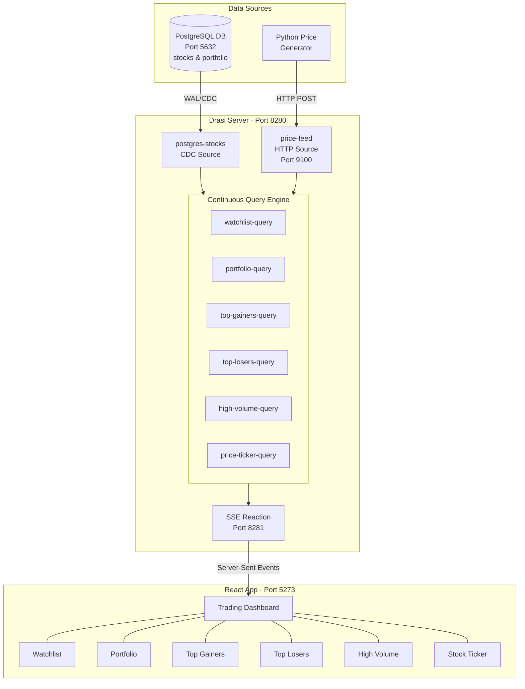

# Drasi Trading Demo

A real-time stock trading dashboard that demonstrates **change-driven web application development** using Drasi Server. This example teaches you how to build applications that react instantly to data changes from multiple sources, without polling or complex event processing.

## What You'll Learn

By exploring this example, you'll understand:

1. **What Drasi Is** - A data change processing platform that detects meaningful changes through continuous queries
2. **Continuous Queries** - Queries that maintain live result sets and notify you when results change
3. **Multi-Source Integration** - Combining data from PostgreSQL (CDC) and HTTP sources in a single query
4. **Synthetic Joins** - Creating relationships between data from different sources without database foreign keys
5. **Change-Driven Architecture** - Building UIs that update only when data actually changes (no polling)
6. **Server-Sent Events (SSE)** - Using Drasi's reaction system to push changes to connected clients

## Understanding Drasi

### The Problem Drasi Solves

Traditional approaches to building reactive applications require:
- **Polling**: Repeatedly querying databases for changes (wasteful, laggy)
- **Event Parsing**: Writing complex code to interpret generic database events
- **State Management**: Manually tracking what data you've seen before
- **Multi-Source Coordination**: Building custom pipelines to join data from different systems

### Drasi's Approach

Drasi inverts this model. Instead of reacting to low-level database events, you write **continuous queries** that define exactly what changes matter to you:

```cypher
-- "Notify me when any stock in my watchlist has a price change"
MATCH (s:stocks)-[:HAS_PRICE]->(sp:stock_prices)
WHERE s.symbol IN ['AAPL', 'MSFT', 'GOOGL']
RETURN s.symbol, sp.price, sp.previous_close
```

Drasi continuously evaluates this query against your data sources and notifies you **only when the result set changes**—not on every database change.

### Core Concepts

| Concept | Description | In This Example |
|---------|-------------|-----------------|
| **Source** | A data repository that Drasi monitors for changes | PostgreSQL (stocks, portfolio tables) + HTTP (real-time prices) |
| **Continuous Query** | A graph query that maintains a live result set | 6 queries: watchlist, portfolio, gainers, losers, volume, ticker |
| **Reaction** | An action triggered when query results change | SSE reaction pushes changes to the React app |
| **Synthetic Join** | A relationship defined in queries, not in the database | `HAS_PRICE` links stocks to prices across sources |

## Architecture



**Key Data Flows:**

1. **PostgreSQL → PostgreSQL Source**: Logical replication streams changes from `stocks` and `portfolio` tables
2. **Price Generator → HTTP Source**: Python script POSTs price updates to the HTTP source endpoint
3. **Sources → Query Engine**: Both sources feed data into the continuous query engine
4. **Query Engine → SSE Reaction**: Query result changes trigger the SSE reaction
5. **SSE → React App**: Server-Sent Events push updates to the browser in real-time

## Quick Start

There are three ways to run the Trading Demo:

### Option 1: Dev Container (Recommended)

Open this repository in VS Code and select **"Reopen in Container"** from the Command Palette (`Cmd+Shift+P` / `Ctrl+Shift+P`). When prompted, choose **"Drasi Server - Trading Demo"**. The demo will build and start automatically — once the container is ready, open **http://localhost:5273** to see the live trading dashboard.

### Option 2: GitHub Codespaces

Click **Code → Codespaces → New codespace** on the repository's GitHub page. Select the **"Drasi Server - Trading Demo"** dev container configuration. The demo will start automatically once the codespace is ready. Open the forwarded port **5273** from the Ports tab.

### Option 3: Run Locally

#### Prerequisites

- **Docker** and Docker Compose (for PostgreSQL)
- **Node.js 16+** and npm (for the React app)
- **Python 3.7+** (for the price generator)
- **Rust toolchain** (if building Drasi Server from source)

#### One-Command Start

```bash
# From the examples/trading directory
./start-demo.sh
```

This script:
1. Starts PostgreSQL with sample data (50 stocks, 8 portfolio positions)
2. Builds and starts Drasi Server with sources configured
3. Installs dependencies and starts the React app
4. Starts the Python price generator

**Open http://localhost:5273** to see the live trading dashboard.

To stop everything:
```bash
./stop-demo.sh
```

### Manual Setup (For Learning)

For a deeper understanding, start each component individually:

#### Step 1: Start the Database

```bash
cd database
docker-compose up -d
```

This starts PostgreSQL with:
- `stocks` table: 50 stocks with symbol, name, sector, market cap
- `portfolio` table: 8 demo positions
- Logical replication configured for CDC

#### Step 2: Build and Start Drasi Server

```bash
# From drasi-server root directory
cargo build --release
./target/release/drasi-server --config examples/trading/server/trading-sources-only.yaml
```

The server starts with two sources pre-configured:
- `postgres-stocks`: CDC source monitoring stocks and portfolio tables
- `price-feed`: HTTP source receiving real-time price updates

#### Step 3: Start the React Application

```bash
cd app
npm install
npm run dev
```

At startup the app automatically:
1. Creates all 6 continuous queries via the REST API
2. Creates an SSE reaction to receive live updates
3. Connects to the SSE stream for real-time data

#### Step 4: Start the Price Generator

```bash
cd mock-generator
pip install -r requirements.txt
python3 simple_price_generator.py
```

Watch the React app update in real-time as prices change!

## How It Works

### Data Flow

1. **PostgreSQL Source** (`postgres-stocks`) streams changes from PostgreSQL
2. **Price Generator** sends HTTP POST requests with price updates
3. **HTTP Source** (`price-feed`) ingests prices as `stock_prices` nodes
4. **Continuous Queries** join data from both sources using synthetic relationships
5. **Query Engine** detects when result sets change
6. **SSE Reaction** pushes changes to connected clients
7. **React App** updates only the affected UI components

### Synthetic Joins Explained

The magic of this demo is **synthetic joins**—relationships that exist in queries, not in the database.

Consider the portfolio query:
```cypher
MATCH (p:portfolio)-[:OWNS_STOCK]->(s:stocks)-[:HAS_PRICE]->(sp:stock_prices)
RETURN p.symbol, s.name, sp.price, ...
```

There's no `OWNS_STOCK` or `HAS_PRICE` relationship in PostgreSQL. Instead, the query defines these relationships:

```typescript
// In DrasiClient.ts
const hasPrice: QueryJoin = {
  id: 'HAS_PRICE',
  keys: [
    { label: 'stocks', property: 'symbol' },      // stocks.symbol
    { label: 'stock_prices', property: 'symbol' } // stock_prices.symbol (from HTTP)
  ]
};
```

Drasi automatically creates and maintains these relationships when:
- `stocks.symbol === stock_prices.symbol`

This lets you:
- **Join data across different sources** (PostgreSQL + HTTP)
- **Avoid schema changes** in your existing databases
- **Define relationships semantically** based on your query needs

### The React Integration

The `useDrasi.ts` hook provides a simple interface:

```typescript
// Subscribe to a continuous query
const { data, loading, lastUpdate } = useQuery<Stock>('watchlist-query');

// data updates automatically when query results change
// No polling. No manual refetching. No WebSocket plumbing.
```

Under the hood:
1. `DrasiClient` creates queries and an SSE reaction via REST API
2. `DrasiSSEClient` maintains an EventSource connection
3. Query results flow as Server-Sent Events
4. The hook updates component state when relevant data changes

## Code Examples

### Creating a Query

```typescript
const queryConfig = {
  id: 'my-query',
  query: `
    MATCH (s:stocks)-[:HAS_PRICE]->(sp:stock_prices)
    WHERE sp.price > 100
    RETURN s.symbol, sp.price
  `,
  sources: [
    { sourceId: 'postgres-stocks', pipeline: [] },
    { sourceId: 'price-feed', pipeline: [] }
  ],
  joins: [{
    id: 'HAS_PRICE',
    keys: [
      { label: 'stocks', property: 'symbol' },
      { label: 'stock_prices', property: 'symbol' }
    ]
  }],
  autoStart: true
};

await fetch('http://localhost:8280/api/v1/queries', {
  method: 'POST',
  headers: { 'Content-Type': 'application/json' },
  body: JSON.stringify(queryConfig)
});
```

### Creating an SSE Reaction

```typescript
const reactionConfig = {
  kind: 'sse',
  id: 'my-stream',
  queries: ['my-query'],
  autoStart: true,
  host: '0.0.0.0',
  port: 8281,
  ssePath: '/events',
  heartbeatIntervalMs: 15000
};

await fetch('http://localhost:8280/api/v1/reactions', {
  method: 'POST',
  headers: { 'Content-Type': 'application/json' },
  body: JSON.stringify(reactionConfig)
});
```

### Listening to SSE Events

```typescript
const eventSource = new EventSource('http://localhost:8281/events');

eventSource.onmessage = (event) => {
  const data = JSON.parse(event.data);
  // data.queryId - which query result changed
  // data.results - array of changes [{type: 'ADD'|'UPDATE'|'DELETE', data: {...}}]
  // data.timestamp - when the change occurred

  for (const result of data.results) {
    if (result.type === 'ADD') {
      // New row entered the query result set
    } else if (result.type === 'UPDATE') {
      // Existing row's values changed
    } else if (result.type === 'DELETE') {
      // Row exited the query result set
    }
  }
};
```

### Sending Data to HTTP Source

```python
# The price generator sends events like this:
event = {
    "operation": "update",
    "element": {
        "type": "node",
        "id": "price_AAPL",
        "labels": ["stock_prices"],
        "properties": {
            "symbol": "AAPL",
            "price": 175.50,
            "previous_close": 174.00,
            "volume": 45000000
        }
    },
    "timestamp": 1234567890000000000  # nanoseconds
}

requests.post('http://localhost:9100/sources/price-feed/events', json=event)
```

## UI Components

| Component | Query | What It Shows |
|-----------|-------|---------------|
| **Watchlist** | `watchlist-query` | 5 selected stocks (AAPL, MSFT, GOOGL, TSLA, NVDA) with live prices |
| **Portfolio** | `portfolio-query` | Your holdings with real-time P/L calculations |
| **Top Gainers** | `top-gainers-query` | Stocks where `price > previous_close` |
| **Top Losers** | `top-losers-query` | Stocks where `price < previous_close` |
| **High Volume** | `high-volume-query` | Stocks with `volume > 10,000,000` |
| **Stock Ticker** | `price-ticker-query` | All price updates in a scrolling ticker |

## Configuration Files

| File | Purpose |
|------|---------|
| `server/trading-sources-only.yaml` | Drasi Server configuration with sources |
| `database/docker-compose.yml` | PostgreSQL container with replication |
| `database/init.sql` | Schema, sample data, replication setup |
| `app/src/services/DrasiClient.ts` | Query definitions and Drasi integration |
| `app/src/hooks/useDrasi.ts` | React hook for consuming Drasi queries |
| `mock-generator/simple_price_generator.py` | Simulated market data feed |

## Troubleshooting

### "Replication slot already exists"

```bash
cd database
./clean-replication.sh
```

### Queries not updating

1. Check sources are running: `curl http://localhost:8280/api/v1/sources`
2. Check queries exist: `curl http://localhost:8280/api/v1/queries`
3. Check SSE connection in browser DevTools (Network tab, filter by EventSource)

### Database reset

```bash
cd database
docker-compose down -v
docker-compose up -d
```

### Port conflicts

```bash
# Check what's using ports
lsof -i :8280  # Drasi Server
lsof -i :9100  # HTTP Source
lsof -i :8281 # SSE Reaction
lsof -i :5273  # React app
lsof -i :5632  # PostgreSQL
```

## Key Concepts Demonstrated

| Concept | Traditional Approach | Drasi Approach |
|---------|---------------------|----------------|
| **Detecting changes** | Poll database every N seconds | Continuous query notifies on change |
| **Multi-source data** | ETL pipeline or manual coordination | Single query spans multiple sources |
| **Real-time UI** | WebSocket + custom message handling | SSE reaction + standard EventSource |
| **Join across systems** | Denormalize or build join service | Synthetic joins in query definition |
| **Filtering changes** | Parse all events, filter in code | Query defines what matters |

## Learn More

- [Drasi Documentation](https://drasi.io/)
- [Drasi Project on GitHub](https://github.com/drasi-project)
- [Cypher Query Language](https://neo4j.com/developer/cypher/)
- [PostgreSQL Logical Replication](https://www.postgresql.org/docs/current/logical-replication.html)

## License

Copyright 2025 The Drasi Authors. Licensed under the Apache License, Version 2.0.
