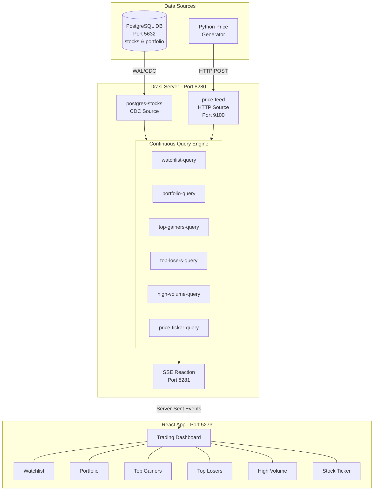

# Drasi Trading Demo

A real-time stock trading dashboard that demonstrates **change-driven web application development** using Drasi Server. This example teaches you how to build applications that react instantly to data changes from multiple sources, without polling or complex event processing.

## What You'll Learn

By exploring this example, you'll understand:

1. **What Drasi Is** - A data change processing platform that detects meaningful changes through continuous queries
2. **Continuous Queries** - Queries that maintain live result sets and notify you when results change
3. **Multi-Source Integration** - Combining data from PostgreSQL (CDC) and HTTP sources in a single query
4. **Synthetic Joins** - Creating relationships between data from different sources without database foreign keys
5. **Change-Driven Architecture** - Building UIs that update only when data actually changes (no polling)
6. **Server-Sent Events (SSE)** - Using Drasi's reaction system to push changes to connected clients

## Understanding Drasi

### The Problem Drasi Solves

Traditional approaches to building reactive applications require:
- **Polling**: Repeatedly querying databases for changes (wasteful, laggy)
- **Event Parsing**: Writing complex code to interpret generic database events
- **State Management**: Manually tracking what data you've seen before
- **Multi-Source Coordination**: Building custom pipelines to join data from different systems

### Drasi's Approach

Drasi inverts this model. Instead of reacting to low-level database events, you write **continuous queries** that define exactly what changes matter to you:

```cypher
-- "Notify me when any stock in my watchlist has a price change"
MATCH (s:stocks)-[:HAS_PRICE]->(sp:stock_prices)
WHERE s.symbol IN ['AAPL', 'MSFT', 'GOOGL']
RETURN s.symbol, sp.price, sp.previous_close
```

Drasi continuously evaluates this query against your data sources and notifies you **only when the result set changes**—not on every database change.

### Core Concepts

| Concept | Description | In This Example |
|---------|-------------|-----------------|
| **Source** | A data repository that Drasi monitors for changes | PostgreSQL (stocks, portfolio tables) + HTTP (real-time prices) |
| **Continuous Query** | A graph query that maintains a live result set | 11 queries: watchlist, portfolio, summary, sectors, gainers, losers, volume, ticker, orders, stale orders, expiring orders |
| **Reaction** | An action triggered when query results change | SSE reaction pushes changes to the React app |
| **Synthetic Join** | A relationship defined in queries, not in the database | `HAS_PRICE` links stocks to prices across sources |

## Architecture


```mermaid
flowchart TB
    subgraph Sources["Data Sources"]
        PG[(PostgreSQL DB<br/>Port 5632<br/>stocks & portfolio)]
        GEN[Python Price<br/>Generator]
    end

    subgraph Drasi["Drasi Server · Port 8280"]
        SRC1[postgres-stocks<br/>CDC Source]
        SRC2[price-feed<br/>HTTP Source<br/>Port 9100]

        subgraph QE["Continuous Query Engine"]
            Q1[watchlist-query]
            Q2[portfolio-query]
            Q3[top-gainers-query]
            Q4[top-losers-query]
            Q5[high-volume-query]
            Q6[price-ticker-query]
        end

        SSE[SSE Reaction<br/>Port 8281]
    end

    subgraph App["React App · Port 5273"]
        UI[Trading Dashboard]
        W[Watchlist]
        P[Portfolio]
        G[Top Gainers]
        L[Top Losers]
        V[High Volume]
        T[Stock Ticker]
    end

    PG -->|WAL/CDC| SRC1
    GEN -->|HTTP POST| SRC2
    SRC1 --> QE
    SRC2 --> QE
    QE --> SSE
    SSE -->|Server-Sent Events| UI
    UI --- W & P & G & L & V & T
```

**Key Data Flows:**

1. **PostgreSQL → PostgreSQL Source**: Logical replication streams changes from `stocks` and `portfolio` tables
2. **Price Generator → HTTP Source**: Python script POSTs price updates to the HTTP source endpoint
3. **Sources → Query Engine**: Both sources feed data into the continuous query engine
4. **Query Engine → SSE Reaction**: Query result changes trigger the SSE reaction
5. **SSE → React App**: Server-Sent Events push updates to the browser in real-time

## Quick Start

There are three ways to run the Trading Demo:

### Option 1: Dev Container (Recommended)

Open this repository in VS Code and select **"Reopen in Container"** from the Command Palette (`Cmd+Shift+P` / `Ctrl+Shift+P`). When prompted, choose **"Drasi Server - Trading Demo"**. Post-create prepares the exact compatible sibling engine, builds this checkout and its Web UI, and installs the preserved signed plugins. Once ready, run `bash examples/trading/start-demo.sh` and open **http://localhost:5273**.

### Option 2: GitHub Codespaces

Click **Code → Codespaces → New codespace** on the repository's GitHub page. Select the **"Drasi Server - Trading Demo"** dev container configuration. After the source-backed setup completes, run `bash examples/trading/start-demo.sh`. Open the forwarded port **5273** from the Ports tab.

Both routes use the same source/plugin preparation as local startup, not an
arbitrary latest release or an empty UI placeholder. The unpublished
[engine prerequisite](../../docs/engine-prerequisite.md) does not modify any
published binary. Existing mismatched core checkouts or conflicting plugin pins
fail without being overwritten.

### Option 3: Run Locally

#### Prerequisites

- **Docker** and Docker Compose (for PostgreSQL)
- **Node.js 22** and npm (the existing CI baseline)
- **Python 3.11+** (plugin preparation and the price generator)
- **Rust toolchain** from the repository's `rust-toolchain.toml`

#### One-Command Start

```bash
# From the examples/trading directory
./start-demo.sh
```

This script:
1. Starts PostgreSQL with sample data (50 stocks, 8 portfolio positions)
2. Builds this checkout and its Web UI with the exact sibling engine and compatible signed plugins, then starts Drasi Server with sources configured
3. Installs dependencies and starts the React app
4. Starts the Python price generator

**Open http://localhost:5273** to see the live trading dashboard.

To stop everything:
```bash
./stop-demo.sh
```

### Manual Setup (For Learning)

For a deeper understanding, start each component individually:

#### Step 1: Start the Database

```bash
cd database
docker-compose up -d
```

This starts PostgreSQL with:
- `stocks` table: 50 stocks with symbol, name, sector, market cap
- `portfolio` table: 8 demo positions
- Logical replication configured for CDC

#### Step 2: Build and Start Drasi Server

```bash
# From drasi-server root directory
bash scripts/prepare-trading.sh
./target/release/drasi-server --config examples/trading/server/trading-sources-only.yaml
```

Preparation installs the SSE plugin but does not create any queries or
reactions; the app still performs its existing automatic setup. Registry-SDK
mode verifies signatures. Deliberate matching local-SDK development remains a
separate unsigned-plugin mode, selected by Cargo's resolved origins rather than
the existence of `../drasi-core`.

The server starts with two sources pre-configured:
- `postgres-stocks`: CDC source monitoring stocks and portfolio tables
- `price-feed`: HTTP source receiving real-time price updates

#### Step 3: Start the React Application

```bash
cd app
npm install
npm run dev
```

At startup the app automatically:
1. Resolves the demo's single instance and attempts a read-only connection
2. On typed missing/stopped-resource errors, creates/starts only the 11 known
   Trading queries and SSE reaction, waits for readiness, and retries once
3. Reuses existing running resources without redundant writes

No manual query/reaction setup is needed. `TradingProvider` owns this behavior;
the reusable package is connect-only. On a multi-instance server configure
`<TradingProvider instanceId="your-instance">` explicitly instead of guessing
the first instance. The normal REST/SSE URLs remain 8280/8281.

#### Step 4: Start the Price Generator

```bash
cd mock-generator
pip install -r requirements.txt
python3 simple_price_generator.py
```

Watch the React app update in real-time as prices change!

### Regression checks

See [Testing and behavior baseline](TESTING.md) for executable app integration
tests, deterministic browser/visual fixtures, clean tarball consumption and
real-server smoke prerequisites. These test-only ports and fixtures do not
change the startup commands or URLs above.

## How It Works

### Data Flow

1. **PostgreSQL Source** (`postgres-stocks`) streams changes from PostgreSQL
2. **Price Generator** sends HTTP POST requests with price updates
3. **HTTP Source** (`price-feed`) ingests prices as `stock_prices` nodes
4. **Continuous Queries** join data from both sources using synthetic relationships
5. **Query Engine** detects when result sets change
6. **SSE Reaction** pushes changes to connected clients
7. **React App** updates only the affected UI components

### Synthetic Joins Explained

The magic of this demo is **synthetic joins**—relationships that exist in queries, not in the database.

Consider the portfolio query:
```cypher
MATCH (p:portfolio)-[:OWNS_STOCK]->(s:stocks)-[:HAS_PRICE]->(sp:stock_prices)
RETURN p.symbol, s.name, sp.price, ...
```

There's no `OWNS_STOCK` or `HAS_PRICE` relationship in PostgreSQL. Instead, the query defines these relationships:

```typescript
// In services/queries.ts
const hasPrice: QueryJoin = {
  id: 'HAS_PRICE',
  keys: [
    { label: 'stocks', property: 'symbol' },      // stocks.symbol
    { label: 'stock_prices', property: 'symbol' } // stock_prices.symbol (from HTTP)
  ]
};
```

Drasi automatically creates and maintains these relationships when:
- `stocks.symbol === stock_prices.symbol`

This lets you:
- **Join data across different sources** (PostgreSQL + HTTP)
- **Avoid schema changes** in your existing databases
- **Define relationships semantically** based on your query needs

### The React Integration

The UI is built on a **standalone, reusable component package**,
[`@drasi/react`](../../dev-tools/react), which lives in the repo's
`dev-tools/react` directory but is completely independent of this example. The app
consumes it exactly like an external dependency (`@drasi/react`). The package
provides a single multiplexed SSE connection, React hooks for live query results,
provider-free `DataTable` presentation, a headless sort controller and a small
live `QueryTable` composition. Trading's local `TradingQueryTable` adds the
demo's tutorial and fullscreen UI; those features are not package behavior.

A component subscribes to a continuous query with the `useDrasiQuery` hook (or by
using Trading's `TradingQueryTable` wrapper):

```typescript
import { useDrasiQuery } from '@drasi/react/react';
import { tradingQueryOptions } from './drasi/queryOptions';

// Subscribe to a continuous query over the shared connection
const { data, loading, lastUpdate } = useDrasiQuery(
  'watchlist-query', tradingQueryOptions('watchlist-query'),
);

// data updates automatically when query results change
// No polling. No manual refetching. No WebSocket plumbing.
```

The shared connection is established once near the root of the app by wrapping it
in the app-owned `<TradingProvider>` (see `app/src/main.tsx`):

```tsx
import { TradingProvider } from '@/drasi/TradingProvider';

<TradingProvider>
  <App />
</TradingProvider>
```

Under the hood:
1. `TradingProvider` attempts `DrasiClient.initialize()` with explicit instance,
   query IDs and `{ id, endpoint }` reaction references. The package only reads.
   `ensureTradingResources.ts` catches eligible typed failures and owns setup.
2. The package's `DrasiSSEClient` maintains a **single** EventSource connection
   and multiplexes every query over it
3. Query results flow as Server-Sent Events and are fanned out to subscribers by
   query id
4. `useDrasiQuery` updates component state when the relevant query changes

All the trading‑specific knowledge — the list of queries, the SSE reaction
settings, how to route aggregation result changes, and per‑query
key/transform/sort rules — lives in the app under `app/src/drasi/`, so the package
itself stays generic and reusable. See [Reusable React components](#reusable-react-components)
for details.

Setup is shared across concurrent consumers, with Web Locks for tabs where
available and 409/read validation otherwise. It has a 60-second deadline,
10-second request timeouts, readiness polling and cancellation when the last
consumer unmounts. Starting/bootstrapping resources are waited on, never started
again. Partial success is retained and reused on a later explicit retry.

Before writing, Trading checks existing known definitions: exact query text
(ignoring outer whitespace), explicit **Cypher**, ordered source subscriptions
and joins, plus reaction kind/membership/host/port/path/heartbeat settings.
Conflict, malformed data, auth, unknown instance and network failures stop setup;
it never overwrites resources or manages sources/plugins. Query POST bodies are
projected explicitly from the app definitions, omitting the app-only `description`.
All writes use the resolved instance. Successful initial read-only connections
do not run this desired-definition preflight or reconcile deployment settings.

The app uses the package's controlled `DrasiClientProvider` to bind hooks to the
same single client during resolution/setup and streaming. Terminal errors keep
their `DrasiError` identity and show a **Retry connection** control; stream/network
errors alone never authorize creation. Package reconnect/snapshot attempts are
bounded as described in its [error/retry contract](../../dev-tools/react/README.md#errors-and-recovery).
Business actions, financial transforms, query/source/join ordering, routing,
sorting defaults and successful dashboard appearance are unchanged.

For non-local hosting, use TLS and configure the reverse proxy's
`Content-Security-Policy`, `Strict-Transport-Security`,
`X-Content-Type-Options: nosniff` and `X-Frame-Options: DENY` headers, together
with explicit allowed origins and appropriate authentication.

### Reusable React components

The [`@drasi/react`](../../dev-tools/react) package (in the repo's
`dev-tools/react` directory) is an independent, documented React package extracted
from this example so it can be reused in any Drasi application:

| Export | Purpose |
|--------|---------|
| `DrasiProvider` | Connects to existing running resources using explicit references |
| `DrasiClientProvider` | Binds hooks to an app-owned lifecycle without another connection |
| `DrasiError` | Stable typed error codes, resource/instance identity and retryability |
| `useDrasiQuery` | Subscribe to a query; returns its accumulated, live result set |
| `useDrasiConnectionStatus` | Track connection/reconnection state |
| `useTableSort` / `useRowAnimation` | Headless sort and animation state shared by multiple presentations |
| `DataTable` | Provider-free presentation of readonly rows and app-owned state |
| `QueryTable` / `queryTableState` | Small live table composition / pure query-to-presentation state adapter |
| `DrasiClient` / `DrasiSSEClient` | Low-level orchestrator and SSE multiplexer |

The app declares `@drasi/react` as
`file:../../../dev-tools/react`. Its `predev` and `prebuild` scripts build the
package before Vite runs, and `app/src/main.tsx` imports
`@drasi/react/styles.css`. There are no package source aliases or consumer
Tailwind content scans: the app consumes the package's built JavaScript,
declarations, and self-contained stylesheet.

The app imports transport/types from `@drasi/react/client`, bindings from
`@drasi/react/react`, and presentation from `@drasi/react/components`.
The root remains a convenience export. Client-only consumers need no React
runtime or React types; hooks do not load components, React DOM or CSS. Neither
table imports CSS implicitly or contains tutorial/dialog implementations.
All entrypoints ship real ESM/CommonJS and declaration artifacts. Trading
retains React 18.3.1; React 19 is not claimed.

The app's `TradingQueryDefinition` remains a creation-only shape with explicit
Cypher and ordered sources/joins; it is not the package's complete read-only
`QueryConfig` DTO. Incoming object fields are `unknown`, and app-owned guards
validate the actual per-query projection. High-volume rows, for example, have
`volume` but no `previousClose`; the app does not invent a value for it.
Portfolio numeric conversion retains the existing `parseFloat`, missing/null,
empty-string and invalid-number behavior. Query text, financial calculations
and the known market-mover default sorting remain unchanged.

The package provider compares plain reference/configuration values rather than
object identities, while callable fetch/auth/stream/adapter identities are
material. Trading keeps app-owned lifecycle/provisioning and the controlled
binding; it does not switch back to a package provisioner. See the package's
[auth](../../dev-tools/react/README.md#authentication-and-injected-transports),
[ownership](../../dev-tools/react/README.md#ownership-and-reconfiguration),
[SSR](../../dev-tools/react/README.md#ssr-and-import-safety) and
[P4 migration](../../dev-tools/react/README.md#p4--163-part-b-migration) contracts.

#### App-owned tables and inspection (P5 / #164 Part A)

`app/src/components/TradingQueryTable.tsx` owns one `useDrasiQuery`
subscription, one shared `useTableSort` controller and one `useRowAnimation`
tracker. It passes `queryTableState(query, retryConnection)` and the shared
sort/animation state to normal and fullscreen `DataTable` cards. The existing
FLIP transition, card markup and appearance stay app-owned; opening a second
presentation does not create another subscription or socket. Tutorial snippets
now correctly show `<TradingQueryTable ...>` rather than implying these
demo-specific features belong to the package's QueryTable.

The local wrapper's `codeSnippet` enables its code button. Only clicking that
button with a snippet mounts `QueryInspector`, whose `useDrasiQueryDefinition`
hook performs the optional GET. Closing unmounts the inspector and aborts the
read. For its own read failure, **Retry query definition** rekeys only that read,
never the query subscription or shared connection. If the inspector's non-null
error is the **same object** as `useDrasiClient().error`, it instead offers
**Retry connection** and calls the provider's retry callback. Identical error
codes/messages alone do not select shared recovery; no new package API is
needed. Async results update the already-open code view and copy content
instead of leaving a frozen loading message. Query formatting, tutorial
snippets, Drasi UI links and `CodeViewerDialog` are all app-owned;
`CodeViewerDialog` is no longer a package export.

Plain package tables and closed inspectors do not request tutorial definitions.
This does **not** remove the required initial resource-validation GETs or the
query-resource check performed by every subscription's `getQueryResults` before
its snapshot. Those are connect-only correctness checks, not tutorial traffic.

`useTableSort` supports controlled `sort` (including explicit null) and a
one-time uncontrolled `defaultSort`; null restores input order. Both card
presentations use the same state, not synchronized copies of a second sorting
implementation. All 11 queries, numeric conversions, business filters and
existing default sorts remain unchanged. App actions and provisioning remain
outside the reusable package.

See the package's [P5 migration](../../dev-tools/react/README.md#p5--164-part-a-migration)
and [composition recipes](../../dev-tools/react/README.md#app-owned-composition).
This follows #207 at `20561c13dd74929855dfbe605bb1fac23e5a49f4` under tracker
#161. Package CSS remains byte-for-byte unchanged, including the legacy
dialog/fullscreen rules used here. P6 focus management, coordinated overlays,
theming, reduced-motion and height completion remain separate; no new example
app/Storybook (#165) or backend/protocol change is included.

#### Result identity and recovery (#163 Part B)

Every Trading hook and table supplies `tradingQueryOptions(queryId)`: required
raw `getKey`, a validating `transform`, and pure derived sorting/filtering.
Keys are nonempty business identities, never serialized whole rows. Portfolio
uses position ID with the existing symbol fallback, summary uses its singleton
key, and the remaining queries retain their existing symbol/sector/ID choices.
Sparse deletes are keyed **before** projection; a portfolio `{ id }` delete
does not need prices or a symbol. `TradingQueryTable.rowKey`, forwarded to
DataTable, is a separate transformed render/animation key. Portfolio uses the
same position identity there;
the existing symbol-based edit/delete lookup and order identity limitations
remain documented in [TESTING.md](TESTING.md#known-baseline-limitations-not-refactor-regressions).

`config.ts` selects `tradingResultAdapter` once at module scope using
`createLegacyResultAdapter({ routeUnidentified: routeTradingData })`.
Official SSE envelopes carry `queryId`, `results` and `timestamp`, so they
never depend on Trading's shape heuristics. The explicit legacy adapter also
supports the named historical forms; envelope IDs always take precedence.
Unidentified rows retain the existing financial routing and price fan-out,
but every row must route synchronously using its original reference. Unknown
rows fail safely with `UNROUTABLE_RESULT` and are not printed to the console.
An unidentified legacy before/after update is represented as delete then
upsert, not an identity-preserving update; prefer identified official envelopes.

Hooks expose `status`, `stale`, `errorScope` and query-local `retry()` alongside
data/loading/error/lastUpdate. Query retry refreshes only that subscription's
REST read; shared connection retry remains `useDrasiClient().retry`. The app's
controlled provider owns setup/connection lifecycle, not a second package owner.

REST snapshots and SSE have no shared cursor. Any nonempty delta overlapping a
snapshot produces visible `SNAPSHOT_OVERLAP` and bounded read reconciliation,
not replay of ambiguously ordered changes. Pending changes are counted without
retaining their row bodies (default limit 10,000); overflow aborts the read and
surfaces `RESULT_BUFFER_OVERFLOW`. Recovery uses a finite retry budget and
retains last-good rows as stale where available. Query protocol errors do not
close the shared stream. A successful read with no known overlap is still
best effort, **not** an atomic, gap-free or exactly-once consistency guarantee.

Validate the package independently before consuming it:

```bash
cd ../../dev-tools/react
npm ci
npm run typecheck
npm test
npm run build
npm pack --dry-run
```

Full API documentation, usage, styling, and build instructions are in
[`dev-tools/react/README.md`](../../dev-tools/react/README.md).

## Code Examples

### Creating a Query

```typescript
const queryConfig = {
  id: 'my-query',
  query: `
    MATCH (s:stocks)-[:HAS_PRICE]->(sp:stock_prices)
    WHERE sp.price > 100
    RETURN s.symbol, sp.price
  `,
  sources: [
    { sourceId: 'postgres-stocks', pipeline: [] },
    { sourceId: 'price-feed', pipeline: [] }
  ],
  joins: [{
    id: 'HAS_PRICE',
    keys: [
      { label: 'stocks', property: 'symbol' },
      { label: 'stock_prices', property: 'symbol' }
    ]
  }],
  autoStart: true
};

await fetch('http://localhost:8280/api/v1/queries', {
  method: 'POST',
  headers: { 'Content-Type': 'application/json' },
  body: JSON.stringify(queryConfig)
});
```

### Creating an SSE Reaction

```typescript
const reactionConfig = {
  kind: 'sse',
  id: 'my-stream',
  queries: ['my-query'],
  autoStart: true,
  host: '0.0.0.0',
  port: 8281,
  ssePath: '/events',
  heartbeatIntervalMs: 15000
};

await fetch('http://localhost:8280/api/v1/reactions', {
  method: 'POST',
  headers: { 'Content-Type': 'application/json' },
  body: JSON.stringify(reactionConfig)
});
```

### Listening to SSE Events

```typescript
const eventSource = new EventSource('http://localhost:8281/events');

eventSource.onmessage = (event) => {
  const data = JSON.parse(event.data);
  // data.queryId - which query result changed
  // data.results - array of changes [{type: 'ADD'|'UPDATE'|'DELETE', data: {...}}]
  // data.timestamp - when the change occurred

  for (const result of data.results) {
    if (result.type === 'ADD') {
      // New row entered the query result set
    } else if (result.type === 'UPDATE') {
      // Existing row's values changed
    } else if (result.type === 'DELETE') {
      // Row exited the query result set
    }
  }
};
```

### Sending Data to HTTP Source

```python
# The price generator sends events like this:
event = {
    "operation": "update",
    "element": {
        "type": "node",
        "id": "price_AAPL",
        "labels": ["stock_prices"],
        "properties": {
            "symbol": "AAPL",
            "price": 175.50,
            "previous_close": 174.00,
            "volume": 45000000
        }
    },
    "timestamp": 1234567890000000000  # nanoseconds
}

requests.post('http://localhost:9100/sources/price-feed/events', json=event)
```

## UI Components

| Component | Query | What It Shows |
|-----------|-------|---------------|
| **Watchlist** | `watchlist-query` | 5 selected stocks (AAPL, MSFT, GOOGL, TSLA, NVDA) with live prices |
| **Portfolio** | `portfolio-query` | Your holdings with real-time P/L calculations |
| **Top Gainers** | `top-gainers-query` | Stocks where `price > previous_close` |
| **Top Losers** | `top-losers-query` | Stocks where `price < previous_close` |
| **High Volume** | `high-volume-query` | Stocks with `volume > 10,000,000` |
| **Stock Ticker** | `price-ticker-query` | All price updates in a scrolling ticker |

## Configuration Files

| File | Purpose |
|------|---------|
| `server/trading-sources-only.yaml` | Drasi Server configuration with sources |
| `database/docker-compose.yml` | PostgreSQL container with replication |
| `database/init.sql` | Schema, sample data, replication setup |
| `../../dev-tools/react/` | Reusable providers, headless hooks, `DataTable` and `QueryTable` — see [`dev-tools/react/README.md`](../../dev-tools/react/README.md) |
| `app/src/components/TradingQueryTable.tsx` | App-owned normal/fullscreen cards sharing query, sort and animation state |
| `app/src/components/QueryInspector.tsx` / `CodeViewerDialog.tsx` | On-demand definition reads and tutorial/code presentation |
| `app/src/services/queries.ts` | Continuous query definitions |
| `app/src/drasi/config.ts` | App-specific Drasi config: query list, SSE reaction, content routing |
| `app/src/drasi/queryOptions.ts` | Per-query key/transform/sort options passed to the shared components |
| `mock-generator/simple_price_generator.py` | Simulated market data feed |

## Troubleshooting

### "Replication slot already exists"

```bash
cd database
./clean-replication.sh
```

### Queries not updating

1. Check sources are running: `curl http://localhost:8280/api/v1/sources`
2. Check queries exist: `curl http://localhost:8280/api/v1/queries`
3. Check SSE connection in browser DevTools (Network tab, filter by EventSource)

### Database reset

```bash
cd database
docker-compose down -v
docker-compose up -d
```

### Port conflicts

```bash
# Check what's using ports
lsof -i :8280  # Drasi Server
lsof -i :9100  # HTTP Source
lsof -i :8281 # SSE Reaction
lsof -i :5273  # React app
lsof -i :5632  # PostgreSQL
```

## Key Concepts Demonstrated

| Concept | Traditional Approach | Drasi Approach |
|---------|---------------------|----------------|
| **Detecting changes** | Poll database every N seconds | Continuous query notifies on change |
| **Multi-source data** | ETL pipeline or manual coordination | Single query spans multiple sources |
| **Real-time UI** | WebSocket + custom message handling | SSE reaction + standard EventSource |
| **Join across systems** | Denormalize or build join service | Synthetic joins in query definition |
| **Filtering changes** | Parse all events, filter in code | Query defines what matters |

## Learn More

- [Drasi Documentation](https://drasi.io/)
- [Drasi Project on GitHub](https://github.com/drasi-project)
- [Cypher Query Language](https://neo4j.com/developer/cypher/)
- [PostgreSQL Logical Replication](https://www.postgresql.org/docs/current/logical-replication.html)

## License

Copyright 2025 The Drasi Authors. Licensed under the Apache License, Version 2.0.
